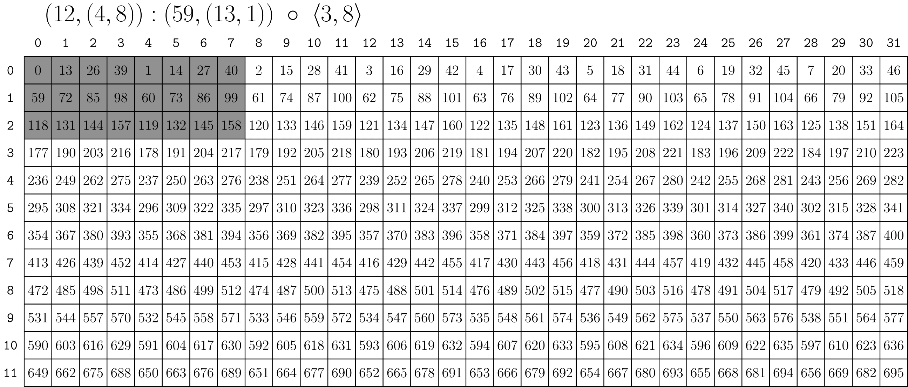

# CuTe 布局代数（CuTe Layout Algebra）

原文：<https://docs.nvidia.com/cutlass/latest/media/docs/cpp/cute/02_layout_algebra.html>

CuTe 提供了一整套“`Layout` 的代数（algebra of `Layout`s）”，用来以不同方式组合布局。这里面最重要的几类操作包括：

- `Layout` 的函数式复合（functional composition）
- `Layout` 的“乘积（product）”，即按照另一个布局去复制某个布局
- `Layout` 的“除法（divide）”，即按照另一个布局去拆分某个布局

很多“从简单布局构造复杂布局”的工具都建立在 product 上；很多“把数据布局按线程布局去分配”的工具则建立在 divide 上；而这二者又都依赖于 `Layout` 的 composition。

本文会逐步建立这些工具，并解释其中几个最核心的操作。

## Coalesce

上一节我们已经把 `Layout` 概括成一句话：

> Layout 本质上是“从整数到整数的函数”。

`coalesce` 可以理解成一种“化简（simplify）”操作。只要我们只关心输入是一维整数坐标，而不关心原始 shape 的层级表达，那么就可以在不改变这个函数本身的前提下，重写 layout 的 shape 和 mode 数量。唯一不能改变的是 `Layout` 的 `size`。

文档中的后置条件（post-conditions）可以概括为：

```cpp
// @post size(@a result) == size(@a layout)
// @post depth(@a result) <= 1
// @post for all i, 0 <= i < size(@a layout), @a result(i) == @a layout(i)
Layout coalesce(Layout const& layout)
```

例如：

```cpp
auto layout = Layout<Shape <_2,Shape <_1,_6>>,
                     Stride<_1,Stride<_6,_2>>>{};
auto result = coalesce(layout);    // _12:_1
```

结果 mode 更少，也更“简单”。如果坐标映射和索引映射是在运行时完成的，这种化简还能直接减少计算量。

它的规则可以归纳为四种情况。设两个相邻 mode 是 `s0:d0` 和 `s1:d1`：

1. `s0:d0 ++ _1:d1 => s0:d0`  
   大小为静态 1 的 mode 可以忽略。
2. `_1:d0 ++ s1:d1 => s1:d1`  
   同理，静态 1 的 mode 可以忽略。
3. `s0:d0 ++ s1:(s0*d0) => (s0*s1):d0`  
   如果第二个 mode 的 stride 恰好等于第一个 mode 的 size 与 stride 的乘积，这两个 mode 就能合并。
4. `s0:d0 ++ s1:d1 => (s0,s1):(d0,d1)`  
   其余情况不能合并，只能保留。

因此，对任意 layout，只要先 flatten，再把相邻 mode 按上面的二元规则依次合并，就能得到 coalesced 结果。

### 按 mode 的 Coalesce（By-mode Coalesce）

有时我们确实在意 layout 的外层 shape。例如，我有一个二维 layout，希望 coalesce 之后仍然保持二维。

因此，CuTe 还提供了一个带额外参数的重载：

```cpp
// Apply coalesce at the terminals of trg_profile
Layout coalesce(Layout const& layout, IntTuple const& trg_profile)
```

示例：

```cpp
auto a = Layout<Shape <_2,Shape <_1,_6>>,
                Stride<_1,Stride<_6,_2>>>{};
auto result = coalesce(a, Step<_1,_1>{});   // (_2,_6):(_1,_2)
// Identical to
auto same_r = make_layout(coalesce(layout<0>(a)),
                          coalesce(layout<1>(a)));
```

`Step<_1,_1>{}` 在这里更像一组“递归标记”：遇到整数位置就对对应子布局做 `coalesce`，遇到 tuple 就继续往里走。

这一模式很常见：先把一个 `Layout` 当成“从整数到整数的函数”去定义操作，再把它推广到任意层级 shape 上的按-mode 版本。

## Composition

`Layout` 的函数式复合（functional composition）是 CuTe 最核心的操作之一，几乎所有更高层构件都会用到它。

既然 `Layout` 本质上是函数，那么我们就可以直接定义：

`R := A o B`

即：

`R(c) := A(B(c))`

文档给出的一个例子是：

```text
A = (6,2):(8,2)
B = (4,3):(3,1)
```

对这个例子做复合后，可以得到一个新的 `Layout`：

```console
R = ((2,2),3):((24,2),8)
```

并且 `B` 与 `R` 兼容：

```console
compatible(B, R)
```

这很好理解，因为复合后的结果 `R` 本来就应该接受 `B` 的所有坐标。

对应的后置条件可以写成：

```cpp
// @post compatible(@a layout_b, @a result)
// @post for all i, 0 <= i < size(@a layout_b), @a result(i) == @a layout_a(@a layout_b(i)))
Layout composition(LayoutA const& layout_a, LayoutB const& layout_b)
```

### 如何计算 Composition（Computing Composition）

这里有两个重要观察：

- 一个 layout 可以被看成子布局的拼接：`B = (B_0, B_1, ...)`
- 当 `B` 是单射（injective）时，composition 对拼接是左分配的：  
  `A o (B_0, B_1, ...) = (A o B_0, A o B_1, ...)`

于是，只需要先处理最简单的情况：假设 `B = s:d` 是一个“shape 和 stride 都是整数”的 layout，并把 `A` 视为已经 flatten 且 coalesce 过的 layout。

如果 `A = a:b` 本身就是一维整数 layout，那么结论非常简单：

`A o B = a:b o s:d = s:(b*d)`

意思就是：在 `A` 中按步长 `d` 取前 `s` 个元素。

如果 `A` 是多 mode 的，那么要分成两步看：

1. 先求一个“步进后的 A”，它保留 `A` 中每隔 `d` 个取一个元素的结果。  
   这一步相当于从左到右不断把 `A` 的 shape 拿去“除以 `d`”。
2. 再从这个步进后的 layout 中保留前 `s` 个元素，使结果 shape 与 `B` 兼容。  
   这一步相当于从左到右不断把 shape “对 `s` 取模”。

文档把这两个前提分别称为：

- stride divisibility condition
- shape divisibility condition

CuTe 会在可能时做静态检查。

例如：

`(3,6,2,8):(w,x,y,z) o 16:9 = (1,2,2,4):(9*w,3*x,y,z)`

#### 例 1：完整推导一个 Composition

继续使用：

```text
A = (6,2):(8,2)
B = (4,3):(3,1)
```

先利用“拼接 + 左分配”把它拆开：

```text
R = A o B
  = (6,2):(8,2) o (4,3):(3,1)
  = ((6,2):(8,2) o 4:3, (6,2):(8,2) o 3:1)
```

第一部分：

```text
(6,2):(8,2) o 4:3
```

- 先按 stride `3` 去“除”：  
  `(6,2):(8,2) / 3 = (2,2):(24,2)`
- 再保留和 `4` 兼容的 shape：  
  `(2,2):(24,2) % 4 = (2,2):(24,2)`

第二部分：

```text
(6,2):(8,2) o 3:1
```

- 按 stride `1` 去除，layout 不变
- 再保留前 `3` 个元素：  
  `(6,2):(8,2) % 3 = (3,1):(8,2)`

最后把两个结果拼起来，再适当做 coalesce，就得到：

```text
R = ((2,2),3):((24,2),8)
```

#### 例 2：把一个 layout 重解释成矩阵

```text
20:2 o (5,4):(4,1)
```

这表示：把一维 layout `20:2` 按 row-major 的 `5x4` 方式解释成矩阵。

推导：

1. `(5,4):(4,1)` 看作 `(5:4, 4:1)` 的拼接
2. 分别做复合：
   - `20:2 o 5:4 => 5:8`
   - `20:2 o 4:1 => 4:2`
3. 拼接后得到 `(5:8, 4:2)`
4. 写成矩阵形式，即 `(5,4):(8,2)`

#### 例 3：把一个多 mode layout 重解释成矩阵

```text
(10,2):(16,4) o (5,4):(1,5)
```

这表示：把 `(10,2):(16,4)` 以 column-major 的 `5x4` 方式去看。

主要步骤：

1. 把 `(5,4):(1,5)` 写成 `(5:1,4:5)`
2. 分别做复合：
   - `(10,2):(16,4) o 5:1 => (5,1):(16,4)`
   - `(10,2):(16,4) o 4:5 => (2,2):(80,4)`
3. 拼起来得到 `((5,1):(16,4), (2,2):(80,4))`
4. 做 by-mode coalesce 后得到更紧凑的：
   `(_5,(_2,_2)):(_16,(_80,_4))`

静态 shape/stride 与动态 shape/stride 的打印结果可能长得不一样，但数学上是同一个 layout。差异通常只是动态情形下，CuTe 无法把 size-1 mode 在类型层面彻底消掉。

### 按 mode 的 Composition（By-mode Composition）

类似按-mode `coalesce`，有时我们不想把整个 `A` 当成单个一维函数，而是希望只对某些 mode 分别做 composition。

因此，`composition` 的第二个参数不一定非得是普通 `Layout`，也可以是一个 `Tiler`。在 CuTe 中，tiler 可以是：

- 一个 `Layout`
- 一个由 `Layout` 组成的 tuple

例如：

```cpp
// (12,(4,8)):(59,(13,1))
auto a = make_layout(make_shape (12,make_shape ( 4,8)),
                     make_stride(59,make_stride(13,1)));
// <3:4, 8:2>
auto tiler = make_tile(Layout<_3,_4>{},  // Apply 3:4 to mode-0
                       Layout<_8,_2>{}); // Apply 8:2 to mode-1

// (_3,(2,4)):(236,(26,1))
auto result = composition(a, tiler);
```

这等价于分别对 `a` 的两个 mode 做 composition，再把结果重新拼起来。

下面的图展示了 `result` 在原 layout 中对应的 `3x8` 子布局：


为了方便，CuTe 还允许把 `Shape` 直接当成 tiler 来用。此时，`Shape` 会被解释成“stride 全为 1 的 tuple-of-layouts”。

例如：

```cpp
auto tiler = make_shape(Int<3>{}, Int<8>{});
```

可以等价看成：

```cpp
// <3:1, 8:1>
```

对同一个 `a` 做 composition 后会得到：

```cpp
// (_3,(4,2)):(59,(13,1))
auto result = composition(a, tiler);
```

下图是这个结果对应的 3x8 子布局：



## Composition Tiler

总结一下，`Tiler` 可以是以下三类对象：

1. 一个 `Layout`
2. 一个由 `Tiler` 组成的 tuple
3. 一个 `Shape`，它会被解释成 stride-1 的 tiler

它们都可以作为 `composition` 的第二个参数。

- 如果是普通 `Layout`，那么就按“一维函数复合”的方式理解
- 如果是 tuple-of-tilers 或 shape，则按 mode 逐对做 composition，直到递归到底层 layout

这让 composition 既能完成“取出指定 mode 的任意子布局”，也能完成“把整块数据当成一维向量再重排”的任务。后面的线程块 tiling、MMA 线程/值分区等操作，都会频繁用到这两种能力。

## Complement

在进入 product 和 divide 之前，还需要一个关键操作：`complement`。

如果把 composition 理解成“用布局 `B` 从布局 `A` 中选出某些坐标”，那么自然会问：那些没被选中的坐标去哪了？

为了实现通用 tiling，我们既要能描述“tile 本身”，也要能描述“tile 的重复方式”或“剩余布局（rest）”。`complement` 的作用就是：给定一个 layout，尝试找到另一个 layout，去表示那些“原 layout 没有覆盖到”的部分。

其接口可以写成：

```cpp
Layout complement(LayoutA const& layout_a, Shape const& cotarget)
```

其核心性质包括：

1. 结果 `R` 的 size / cosize 由 `cotarget` 的大小约束
2. `R` 是有序的，stride 为正且递增，因此结果唯一
3. `A` 与 `R` 的 codomain 彼此不重叠，`R` 尽量去“补满” `A` 的 codomain

`cotarget` 最常见的写法只是一个整数，例如 `24`。但有时把它写成带静态结构信息的 `Shape` 更有用，例如 `(_4,7)`。两者的大小都是 28，数学上给出的 complement 一样，但后者能让 CuTe 尽量保留更多静态信息。

### Complement 示例

下面假设所有整数都是静态整数：

- `complement(4:1, 24) = 6:4`  
  因为 `(4,6):(1,4)` 的 cosize 正好是 24。
- `complement(6:4, 24) = 4:1`  
  可以把 `6:4` 中的“洞”看成由 `4:1` 补上。
- `complement((4,6):(1,4), 24) = 1:0`  
  已经铺满，不需要额外补。
- `complement(4:2, 24) = (2,3):(1,8)`
- `complement((2,4):(1,6), 24) = 3:2`
- `complement((2,2):(1,6), 24) = (3,2):(2,12)`

下图展示了最后一个例子：


灰色表示原始 layout `(2,2):(1,6)` 的 codomain，彩色部分则表示 complement 如何把它重复扩展到 cosize 为 `24`。换句话说，`(3,2):(2,12)` 可以理解成“重复布局本身的布局（layout of repetition）”。

## Division（Tiling）

现在可以定义一个 `Layout` 被另一个 `Layout` 去“除”的概念了。直观地说，divide 就是在做 tiling 和 partitioning。

CuTe 定义：

`logical_divide(A, B)`

它会把 `A` 分成两个 mode：

- 第一个 mode：`B` 选中的元素，也就是 tile 本身
- 第二个 mode：没有被 `B` 选中的其余部分，也就是这些 tile 的布局

形式上可以写成：

`A ⊘ B := A o (B, B*)`

其中 `B*` 是 `B` 相对于 `size(A)` 的 complement。

对应实现：

```cpp
template <class LShape, class LStride,
          class TShape, class TStride>
auto logical_divide(Layout<LShape,LStride> const& layout,
                    Layout<TShape,TStride> const& tiler)
{
  return composition(layout, make_layout(tiler, complement(tiler, size(layout))));
}
```

这意味着 divide 其实完全建立在：

- 拼接（concatenation）
- composition
- complement

之上。

一维 Divide 示例（Logical Divide 1-D Example）

设：

- `A = (4,2,3):(2,1,8)`
- `B = 4:2`

意思是：`A` 表示一个 size 为 24 的一维布局，而 `B` 表示“取 4 个元素，步长 2”的 tile。

计算过程：

1. `B = 4:2` 在 `size(A)=24` 下的 complement 是  
   `B* = (2,3):(1,8)`
2. 拼接 `(B, B*) = (4,(2,3)):(2,(1,8))`
3. 用 `A` 与它做 composition，得到：
   `((2,2),(2,3)):((4,1),(2,8))`

图示如下（图片来自官方文档，但是我觉得这图有点问题，没有反映多维布局，下面的示例2更好）：


灰色部分是 tiler `B` 选中的 tile，其余颜色表示 `A` 中剩下的各个 tile。divide 之后，结果的第一个 mode 就是“tile 本体”，第二个 mode 则用来遍历这些 tile。

二维 Divide 示例（Logical Divide 2-D Example）

借助前面定义的 `Tiler` 概念，divide 可以自然推广到多维情形。

例如，一个二维 layout：

`A = (9,(4,8)):(59,(13,1))`

我们想在列方向应用 `3:3`，在行方向应用 `(2,4):(1,8)`。那么 tiler 可以写成：

`B = <3:3, (2,4):(1,8)>`

图示如下：


这里，每个 mode 的结果都被分成了两部分：

- 第一部分是 tile 的子布局
- 第二部分是这些 tile 的索引布局

特别地，结果中每个 mode 的第一部分，也就是子布局 `(3,(2,4)):(177,(13,2))`，恰好就是对原 layout 做 `composition(a, b)` 时会得到的内容。

### Zipped / Tiled / Flat Divide

虽然 `logical_divide` 的数学定义已经清楚，但直接使用时不一定方便。比如，你想取“第 3 个 tile”或者“第 `(1,2)` 个 tile”，更自然的形式往往是把 tile 本体和 tile 索引重组到更好用的 mode 里。

因此，CuTe 提供了几种方便形式：

```text
Layout Shape : (M, N, L, ...)
Tiler Shape  : <TileM, TileN>

logical_divide : ((TileM,RestM), (TileN,RestN), L, ...)
zipped_divide  : ((TileM,TileN), (RestM,RestN,L,...))
tiled_divide   : ((TileM,TileN), RestM, RestN, L, ...)
flat_divide    : (TileM, TileN, RestM, RestN, L, ...)
```

例如：

```cpp
// A: shape is (9,32)
auto layout_a = make_layout(make_shape (Int< 9>{}, make_shape (Int< 4>{}, Int<8>{})),
                            make_stride(Int<59>{}, make_stride(Int<13>{}, Int<1>{})));

auto tiler = make_tile(Layout<_3,_3>{},           // Apply     3:3     to mode-0
                       Layout<Shape <_2,_4>,      // Apply (2,4):(1,8) to mode-1
                              Stride<_1,_8>>{});

// ((TileM,RestM), (TileN,RestN)) with shape ((3,3), (8,4))
auto ld = logical_divide(layout_a, tiler);
// ((TileM,TileN), (RestM,RestN)) with shape ((3,8), (3,4))
auto zd = zipped_divide(layout_a, tiler);
```

此时：

- 第 3 个 tile 的偏移可以写成 `zd(0,3)`
- 第 7 个 tile 的偏移可以写成 `zd(0,7)`
- 第 `(1,2)` 个 tile 的偏移可以写成 `zd(0,make_coord(1,2))`

而 tile 本身总是 `layout<0>(zd)`。事实上，总有：

`layout<0>(zipped_divide(a, b)) == composition(a, b)`

`logical_divide` 会保留原始各 mode 的语义，只是重新排列每个 mode 内部的元素；`zipped_divide` 则更激进，它直接把“tile 本体”聚成一个 mode，把“tile 的索引布局”聚成另一个 mode。

图示如下：


从这个视角看：

- 横向遍历一行，相当于遍历不同 tile
- 纵向遍历一列，相当于在一个 tile 内遍历元素

后面在 `Tensor` 分区时，这种结构会非常有用。

## Product（Tiling）

与 divide 相对，CuTe 也定义了 `Layout` 的 product。

直观地说：

`logical_product(A, B)`

会得到一个两 mode 的 layout：

- 第一个 mode 是 `A` 本身
- 第二个 mode 是“按 `B` 的方式，对 `A` 做唯一复制（unique replication）”后形成的布局

形式化写法：

`A ⊗ B := (A, A* o B)`

对应实现：

```cpp
template <class LShape, class LStride,
          class TShape, class TStride>
auto logical_product(Layout<LShape,LStride> const& layout,
                     Layout<TShape,TStride> const& tiler)
{
  return make_layout(layout, composition(complement(layout, size(layout)*cosize(tiler)), tiler));
}
```

也就是说，product 同样只依赖：

- 拼接
- composition
- complement

### 一维 Product 示例（Logical Product 1-D Example）

设：

- `A = (2,2):(4,1)`
- `B = 6:1`

这表示：`A` 是一个 size 为 4 的一维 tile，我们希望把它复制 6 次。

步骤如下：

1. 计算 `A` 在 `6*4 = 24` 下的 complement：  
   `A* = (2,3):(2,8)`
2. 计算 `A* o B`，结果仍是 `(2,3):(2,8)`
3. 拼接 `(A, A* o B)`，得到：  
   `((2,2),(2,3)):((4,1),(2,8))`

图示如下：


有趣的是，这个结果与前面的一维 divide 示例结果完全相同。

如果换一个 `B`，比如：

`B = (4,2):(2,1)`

那么 tile 的重复次数和排列顺序都会改变：


### 二维 Product 示例（Logical Product 2-D Example）

利用前面已经建立的 by-mode tiler 思路，`logical_product` 也可以推广到二维：


不过文档特别强调：**这不是推荐写法**。因为这里的 `B` 往往非常不直观，甚至需要你先完全了解 `A` 的 shape 与 stride，才能构造出一个合适的 `B`。

更自然的需求通常是：

> “按布局 `B` 去铺排布局 `A`”

并且希望 `A` 与 `B` 的写法彼此独立。

#### Blocked Product 与 Raked Product

为了解决上面的问题，CuTe 提供了两个更常用的接口：

- `blocked_product(LayoutA, LayoutB)`
- `raked_product(LayoutA, LayoutB)`

它们是在一维 `logical_product` 之上的 rank-sensitive 封装。它们利用了 `logical_product` 的兼容性后置条件：

```console
// @post rank(result) == 2
// @post compatible(layout_a, layout<0>(result))
// @post compatible(layout_b, layout<1>(result))
```

既然 `A` 总和结果的 mode-0 兼容，`B` 总和结果的 mode-1 兼容，那么如果让 `A` 和 `B` 拥有相同的顶层 rank，就可以在 product 之后把“同类 mode”重新结合起来：

- `A` 的列 mode 与 `B` 的列 mode 合并
- `A` 的行 mode 与 `B` 的行 mode 合并
- 以此类推

这就是为什么这两个接口被称为 rank-sensitive。

`blocked_product` 的效果如下图：


它表示：把一个 `2x5` 的 row-major layout 作为 tile，铺到一个 `3x4` 的 column-major 排布上。并且 `blocked_product` 还会顺手替你做一些 `coalesce`。

`raked_product` 则会以另一种方式重新结合 mode：


与 block 式排列不同，`raked_product` 会让 tile `A` 与“tile 的布局” `B` 交错（interleave）起来，因此有时也被称为循环分布（cyclic distribution）。

### Zipped / Tiled Product

与 `zipped_divide`、`tiled_divide` 类似，`zipped_product` 和 `tiled_product` 只是对 by-mode `logical_product` 的结果 mode 做重排：

```text
Layout Shape : (M, N, L, ...)
Tiler Shape  : <TileM, TileN>

logical_product : ((M,TileM), (N,TileN), L, ...)
zipped_product  : ((M,N), (TileM,TileN,L,...))
tiled_product   : ((M,N), TileM, TileN, L, ...)
flat_product    : (M, N, TileM, TileN, L, ...)
```

## 版权（Copyright）

以下 BSD-3-Clause 许可证文本保留原文：

Copyright (c) 2017 - 2026 NVIDIA CORPORATION & AFFILIATES. All rights reserved. SPDX-License-Identifier: BSD-3-Clause

```console
  Redistribution and use in source and binary forms, with or without
  modification, are permitted provided that the following conditions are met:

  1. Redistributions of source code must retain the above copyright notice, this
  list of conditions and the following disclaimer.

  2. Redistributions in binary form must reproduce the above copyright notice,
  this list of conditions and the following disclaimer in the documentation
  and/or other materials provided with the distribution.

  3. Neither the name of the copyright holder nor the names of its
  contributors may be used to endorse or promote products derived from
  this software without specific prior written permission.

  THIS SOFTWARE IS PROVIDED BY THE COPYRIGHT HOLDERS AND CONTRIBUTORS "AS IS"
  AND ANY EXPRESS OR IMPLIED WARRANTIES, INCLUDING, BUT NOT LIMITED TO, THE
  IMPLIED WARRANTIES OF MERCHANTABILITY AND FITNESS FOR A PARTICULAR PURPOSE ARE
  DISCLAIMED. IN NO EVENT SHALL THE COPYRIGHT HOLDER OR CONTRIBUTORS BE LIABLE
  FOR ANY DIRECT, INDIRECT, INCIDENTAL, SPECIAL, EXEMPLARY, OR CONSEQUENTIAL
  DAMAGES (INCLUDING, BUT NOT LIMITED TO, PROCUREMENT OF SUBSTITUTE GOODS OR
  SERVICES; LOSS OF USE, DATA, OR PROFITS; OR BUSINESS INTERRUPTION) HOWEVER
  CAUSED AND ON ANY THEORY OF LIABILITY, WHETHER IN CONTRACT, STRICT LIABILITY,
  OR TORT (INCLUDING NEGLIGENCE OR OTHERWISE) ARISING IN ANY WAY OUT OF THE USE
  OF THIS SOFTWARE, EVEN IF ADVISED OF THE POSSIBILITY OF SUCH DAMAGE.
```
