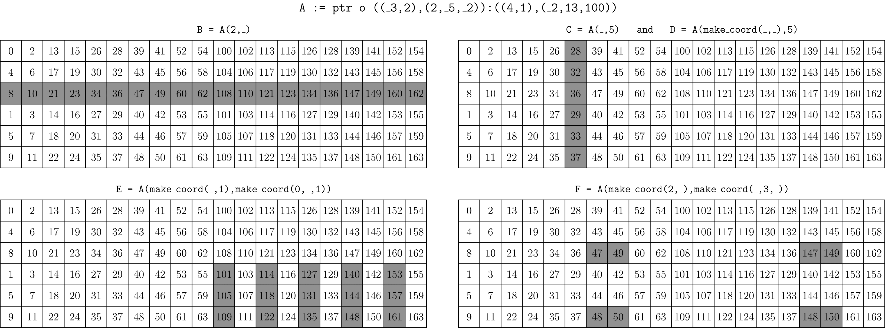

# CuTe 张量（CuTe Tensors）

原文：<https://docs.nvidia.com/cutlass/latest/media/docs/cpp/cute/03_tensor.html>

本文介绍 `Tensor`，这是 CuTe 的核心容器（core container）之一，用来承载前文 `Layout` 章节里介绍过的各种布局概念。

从根本上说，`Tensor` 表示一个多维数组（multidimensional array）。`Tensor` 会把“数组元素如何组织”“数组元素存在哪里”这些细节抽象掉，使你可以用统一的方式编写多维数组算法，并在需要时根据 `Tensor` 的特征做特化（specialization）。例如，你可以根据 `Tensor` 的 rank 做分派，检查其数据 layout，或者验证元素类型。

一个 `Tensor` 由两个模板参数组成：`Engine` 和 `Layout`。`Layout` 的定义请参考 [`01_layout.zh-CN.md`](./01_layout.zh-CN.md)。`Tensor` 会暴露与 `Layout` 相同的 shape 和访问接口；当你访问某个逻辑坐标时，它先调用 `Layout` 计算偏移量，再利用 `Engine` 中保存的随机访问迭代器（random-access iterator）去完成偏移和解引用。

也就是说：

- 数据“怎么排布”，由 `Layout` 负责。
- 数据“从哪里来”，由 `Engine` 负责。

这些数据可以位于任意内存空间，例如全局内存（global memory）、共享内存（shared memory）、寄存器（register memory）；甚至也可以不是预先存好的，而是“按需生成”。

## 基础操作（Fundamental Operations）

CuTe 的 `Tensor` 提供了一组类似容器（container-like）的基础操作：

- `.data()`：返回这个 `Tensor` 持有的 iterator。
- `.size()`：返回这个 `Tensor` 的逻辑总大小。
- `.operator[](Coord)`：用逻辑坐标 `Coord` 访问元素。
- `.operator()(Coord)`：用逻辑坐标 `Coord` 访问元素。
- `.operator()(Coords...)`：等价于先 `make_coord(Coords...)`，再访问对应元素。

`Tensor` 还提供了一组和 `Layout` 类似的层级操作（hierarchical operations）：

- `rank(Tensor)`：返回某个模式的 rank。
- `depth(Tensor)`：返回某个模式的 depth。
- `shape(Tensor)`：返回某个模式的 shape。
- `size(Tensor)`：返回某个模式的 size。
- `layout(Tensor)`：返回某个模式的 layout。
- `tensor(Tensor)`：返回某个模式对应的 subtensor。

## Tensor Engine

`Engine` 可以理解成对“迭代器或数据数组”的一个轻量封装。它提供的接口非常像 `std::array` 的一个极简子集：

```c++
using iterator     =  // The iterator type
using value_type   =  // The iterator value-type
using reference    =  // The iterator reference-type
iterator begin()      // The iterator
```

通常用户不需要自己手动构造 `Engine`。当你创建 `Tensor` 时，CuTe 会自动选择合适的 engine，常见的有 `ArrayEngine`、`ViewEngine` 和 `ConstViewEngine`。

### 带标签的迭代器（Tagged Iterators）

任何随机访问迭代器都可以拿来构造 `Tensor`，但用户也可以给迭代器“打标签（tag）”，标识它访问的是哪种内存空间，例如全局内存或共享内存。

- `make_gmem_ptr(g)`：把 `g` 标记成全局内存 iterator。
- `make_smem_ptr(s)`：把 `s` 标记成共享内存 iterator。

这种内存标签很重要，因为它让 CuTe 的 `Tensor` 算法能够为不同内存类型选择最快的实现。对于一些更底层、更专门的操作，它也能帮助 CuTe 做合法性检查。例如，某些优化 copy 只允许“源是全局内存，目标是共享内存”。有了标签，CuTe 就能正确分派到这些实现，或者在类型层面直接拒绝不合法用法。

## 创建 Tensor（Tensor Creation）

`Tensor` 可以分为两类：

- 拥有型（owning）
- 非拥有型（nonowning）

拥有型 `Tensor` 的行为更像 `std::array`：复制它时会深拷贝元素，析构时会释放自己拥有的那块内存。

非拥有型 `Tensor` 更像原始指针（raw pointer）视图：复制它不会复制元素，销毁它也不会释放底层存储。

这对写通用 `Tensor` 算法的人很重要。例如，函数的输入 `Tensor` 参数应优先按引用或常量引用传递，因为“按值传参”到底会不会深拷贝，取决于它是不是 owning tensor。

### 非拥有型 Tensor（Nonowning Tensors）

大多数情况下，`Tensor` 只是对现有内存的一层非拥有型视图。构造方式通常是调用 `make_tensor`，传入：

- 一个随机访问迭代器
- 一个 `Layout`，或者用于构造 `Layout` 的参数

例如：

```cpp
float* A = ...;

// Untagged pointers
Tensor tensor_8   = make_tensor(A, make_layout(Int<8>{}));  // Construct with Layout
Tensor tensor_8s  = make_tensor(A, Int<8>{});               // Construct with Shape
Tensor tensor_8d2 = make_tensor(A, 8, 2);                   // Construct with Shape and Stride

// Global memory (static or dynamic layouts)
Tensor gmem_8s     = make_tensor(make_gmem_ptr(A), Int<8>{});
Tensor gmem_8d     = make_tensor(make_gmem_ptr(A), 8);
Tensor gmem_8sx16d = make_tensor(make_gmem_ptr(A), make_shape(Int<8>{},16));
Tensor gmem_8dx16s = make_tensor(make_gmem_ptr(A), make_shape (      8  ,Int<16>{}),
                                                   make_stride(Int<16>{},Int< 1>{}));

// Shared memory (static or dynamic layouts)
Layout smem_layout = make_layout(make_shape(Int<4>{},Int<8>{}));
__shared__ float smem[decltype(cosize(smem_layout))::value];   // (static-only allocation)
Tensor smem_4x8_col = make_tensor(make_smem_ptr(smem), smem_layout);
Tensor smem_4x8_row = make_tensor(make_smem_ptr(smem), shape(smem_layout), LayoutRight{});
```

从这些例子可以看出，用户通常先用 `make_gmem_ptr` 或 `make_smem_ptr` 给原始指针打标签，再用 `make_tensor` 把它和 layout 组装起来。非拥有型 `Tensor` 既可以使用静态 layout，也可以使用动态 layout。

对上面这些 tensor 调用 `print`，会得到类似输出：

```console
tensor_8     : ptr[32b](0x7f42efc00000) o _8:_1
tensor_8s    : ptr[32b](0x7f42efc00000) o _8:_1
tensor_8d2   : ptr[32b](0x7f42efc00000) o 8:2
gmem_8s      : gmem_ptr[32b](0x7f42efc00000) o _8:_1
gmem_8d      : gmem_ptr[32b](0x7f42efc00000) o 8:_1
gmem_8sx16d  : gmem_ptr[32b](0x7f42efc00000) o (_8,16):(_1,_8)
gmem_8dx16s  : gmem_ptr[32b](0x7f42efc00000) o (8,_16):(_16,_1)
smem_4x8_col : smem_ptr[32b](0x7f4316000000) o (_4,_8):(_1,_4)
smem_4x8_row : smem_ptr[32b](0x7f4316000000) o (_4,_8):(_8,_1)
```

这些输出会同时显示：

- 指针类型以及内存空间标签
- 指针 `value_type` 的位宽
- 原始地址
- 对应的 `Layout`

### 拥有型 Tensor（Owning Tensors）

`Tensor` 也可以自己拥有一块内存。创建 owning tensor 时，同样调用 `make_tensor`，但这次需要显式给出元素类型 `T`，以及一个 `Layout` 或构造 layout 的参数。

它的内存分配方式与 `std::array` 类似，因此 owning tensor 必须使用“静态 shape + 静态 stride”的 layout。CuTe 不会在 `Tensor` 内部做动态内存分配，因为这在 CUDA kernel 里既不常见，也不高效。

例如：

```c++
// Register memory (static layouts only)
Tensor rmem_4x8_col = make_tensor<float>(Shape<_4,_8>{});
Tensor rmem_4x8_row = make_tensor<float>(Shape<_4,_8>{},
                                         LayoutRight{});
Tensor rmem_4x8_pad = make_tensor<float>(Shape <_4, _8>{},
                                         Stride<_32,_2>{});
Tensor rmem_4x8_like = make_tensor_like(rmem_4x8_pad);
```

其中 `make_tensor_like` 会创建一个新的寄存器 tensor，使其拥有和输入 tensor 相同的值类型、相同 shape，并尽量保持 stride 的顺序特征一致。

打印这些 tensor 会看到类似输出：

```console
rmem_4x8_col  : ptr[32b](0x7fff48929460) o (_4,_8):(_1,_4)
rmem_4x8_row  : ptr[32b](0x7fff489294e0) o (_4,_8):(_8,_1)
rmem_4x8_pad  : ptr[32b](0x7fff489295e0) o (_4,_8):(_32,_2)
rmem_4x8_like : ptr[32b](0x7fff48929560) o (_4,_8):(_8,_1)
```

可以看到，每个 tensor 都有自己独立的地址，这说明它们各自拥有独立的 array-like 存储。

## 访问 Tensor（Accessing a Tensor）

用户可以通过 `operator()` 和 `operator[]` 来访问 `Tensor` 元素，这两个接口都接受逻辑坐标组成的 `IntTuple`。

访问时，`Tensor` 会先用自己的 `Layout` 把逻辑坐标映射成一个 offset，再交给 iterator 去真正取值。`operator[]` 的实现本质上就是：

```c++
template <class Coord>
decltype(auto) operator[](Coord const& coord) {
  return data()[layout()(coord)];
}
```

下面是几个典型例子，演示如何用自然坐标（natural coordinates）、可变参数 `operator()` 和类容器风格的 `operator[]` 进行访问：

```c++
Tensor A = make_tensor<float>(Shape <Shape < _4,_5>,Int<13>>{},
                              Stride<Stride<_12,_1>,    _64>{});
float* b_ptr = ...;
Tensor B = make_tensor(b_ptr, make_shape(13, 20));

// Fill A via natural coordinates op[]
for (int m0 = 0; m0 < size<0,0>(A); ++m0)
  for (int m1 = 0; m1 < size<0,1>(A); ++m1)
    for (int n = 0; n < size<1>(A); ++n)
      A[make_coord(make_coord(m0,m1),n)] = n + 2 * m0;

// Transpose A into B using variadic op()
for (int m = 0; m < size<0>(A); ++m)
  for (int n = 0; n < size<1>(A); ++n)
    B(n,m) = A(m,n);

// Copy B to A as if they are arrays
for (int i = 0; i < A.size(); ++i)
  A[i] = B[i];
```

## 对 Tensor 做分块（Tiling a Tensor）

`Layout` 代数中的很多操作同样可以直接作用在 `Tensor` 上：

```cpp
   composition(Tensor, Tiler)
logical_divide(Tensor, Tiler)
 zipped_divide(Tensor, Tiler)
  tiled_divide(Tensor, Tiler)
   flat_divide(Tensor, Tiler)
```

这些操作都可以把 `Tensor` 拆解成各种有用的 subtensor，在实际里经常用于：

- 线程组级分块（tiling for threadgroups）
- MMA 分块
- 按线程重排数据 tile

需要注意的是，`_product` 这一类操作没有为 `Tensor` 提供实现。原因是 product 往往会扩大 layout 的余域（codomain），这会让 `Tensor` 需要以不可预测的方式访问原先边界之外的数据。`Layout` 可以做 product，但 `Tensor` 通常不能。

## 对 Tensor 做切片（Slicing a Tensor）

如果用一个完整坐标去访问 `Tensor`，得到的是某个元素；如果对 `Tensor` 做 slicing，得到的则是某个模式上保留下来的 subtensor。

切片仍然使用和元素访问相同的 `operator()`。当你传入 `_`（即 `cute::Underscore` 的实例）时，它的效果类似 Fortran 或 Matlab 里的 `:`，表示“这个模式保留，不在这里固定具体坐标”。

一次切片实际上做了两件事：

1. 用部分坐标（partial coordinate）去求值 `Layout`，把得到的 offset 累加到 iterator 上，使新 iterator 指向新 subtensor 的起始位置。
2. 取出切片坐标里那些由 `_` 对应的 layout 模式，重新构造一个新的 layout。这个新 layout 再与新 iterator 一起组成新的 tensor。

示例：

```cpp
// ((_3,2),(2,_5,_2)):((4,1),(_2,13,100))
Tensor A = make_tensor(ptr, make_shape (make_shape (Int<3>{},2), make_shape (       2,Int<5>{},Int<2>{})),
                            make_stride(make_stride(       4,1), make_stride(Int<2>{},      13,     100)));

// ((2,_5,_2)):((_2,13,100))
Tensor B = A(2,_);

// ((_3,_2)):((4,1))
Tensor C = A(_,5);

// (_3,2):(4,1)
Tensor D = A(make_coord(_,_),5);

// (_3,_5):(4,13)
Tensor E = A(make_coord(_,1),make_coord(0,_,1));

// (2,2,_2):(1,_2,100)
Tensor F = A(make_coord(2,_),make_coord(_,3,_));
```



上图展示了如何从原始 tensor 中切出不同 subtensor。一个值得注意的细节是：`C` 和 `D` 包含的是同一批元素，但由于一个使用了 `_`，另一个使用了 `make_coord(_,_)`，它们的 rank 和 shape 并不相同。一般来说，结果 tensor 的 rank 等于切片坐标中 `Underscore` 的数量。

## 对 Tensor 做分区（Partitioning a Tensor）

泛化来看，`Tensor` 的 partitioning 就是：

- 先做 composition 或 tiling
- 再做 slicing

实践中最常用的三种分区方式是：

- inner partitioning
- outer partitioning
- thread-value（TV）layout partitioning

### 内部分区与外部分区（Inner and Outer Partitioning）

先看一个被 tiled 的例子：

```cpp
Tensor A = make_tensor(ptr, make_shape(8,24));  // (8,24)
auto tiler = Shape<_4,_8>{};                    // (_4,_8)

Tensor tiled_a = zipped_divide(A, tiler);       // ((_4,_8),(2,3))
```

假设我们想把这些 `4x8` tile 分给各个 threadgroup，那么就可以用 threadgroup 坐标去索引第二个模式：

```cpp
Tensor cta_a = tiled_a(make_coord(_,_), make_coord(blockIdx.x, blockIdx.y));  // (_4,_8)
```

这叫做 **inner partition**，因为它保留的是内部的“tile 模式”。这种“先套一个 tiler，再通过 remainder mode 选出某个 tile”的写法很常见，因此 CuTe 把它封装成了 `inner_partition(Tensor, Tiler, Coord)`。你也经常会见到 `local_tile(Tensor, Tiler, Coord)`，它其实只是 `inner_partition` 的别名。它非常适合在线程组级别把大 tensor 切成 tile。

如果换个目标：我们有 32 个线程，希望每个线程拿到这个 `4x8` tile 中的一个元素，那么就可以用线程 id 去索引第一个模式：

```cpp
Tensor thr_a = tiled_a(threadIdx.x, make_coord(_,_)); // (2,3)
```

这叫做 **outer partition**，因为它保留的是外部的“剩余模式（rest mode）”。同样地，这种模式也被封装成了 `outer_partition(Tensor, Tiler, Coord)`。

有时你还会看到 `local_partition(Tensor, Layout, Idx)`。它是 `outer_partition` 的一个 rank-sensitive 包装器：

- 先利用 `Layout` 的逆映射把 `Idx` 转换成 `Coord`
- 再构造一个与该 `Layout` 顶层 shape 一致的 `Tiler`

这样一来，你就可以用“行主序线程布局”“列主序线程布局”或者任何自定义线程布局，去把一个 tensor 按线程切开。

这些 partitioning 在实际中的用法，可以参考 GEMM 教程 [`0x_gemm_tutorial.zh-CN.md`](./0x_gemm_tutorial.zh-CN.md)。

### Thread-Value 分区（Thread-Value Partitioning）

另一种很常见的分区策略叫 **thread-value partitioning**。这里的思路是先构造一个 `Layout`，表示“所有线程”以及“每个线程将持有的所有值”映射到目标数据坐标的方式。然后通过 `composition` 把目标数据 layout 变换成这个 TV-layout 所要求的排列方式，最后再按线程维做 slicing。

示例：

```cpp
// Construct a TV-layout that maps 8 thread indices and 4 value indices
//   to 1D coordinates within a 4x8 tensor
// (T8,V4) -> (M4,N8)
auto tv_layout = Layout<Shape <Shape <_2,_4>,Shape <_2, _2>>,
                        Stride<Stride<_8,_1>,Stride<_4,_16>>>{}; // (8,4)

// Construct a 4x8 tensor with any layout
Tensor A = make_tensor<float>(Shape<_4,_8>{}, LayoutRight{});    // (4,8)
// Compose A with the tv_layout to transform its shape and order
Tensor tv = composition(A, tv_layout);                           // (8,4)
// Slice so each thread has 4 values in the shape and order that the tv_layout prescribes
Tensor  v = tv(threadIdx.x, _);                                  // (4)
```


上图是这段代码的可视化结果：左边是任意一个 `4x8` 数据 layout，中间通过一个专门设计的 `8x4` TV-layout 做组合，右边得到的新布局里，每一行对应一个线程拿到的值。最下面的布局则是 TV-layout 的逆，展示了原始 `4x8` 逻辑坐标会映射到哪个 thread id 和 value id。

如何构造和使用这类 partitioning，可以进一步参考 MMA 文档 [`0t_mma_atom.zh-CN.md`](./0t_mma_atom.zh-CN.md)。

## 示例（Examples）

### 从全局内存拷贝一个 subtile 到寄存器

下面的例子会把矩阵的一行一行从全局内存复制到寄存器，然后在寄存器里的这行数据上执行某个算法 `do_something`：

```c++
Tensor gmem = make_tensor(ptr, make_shape(Int<8>{}, 16));  // (_8,16)
Tensor rmem = make_tensor_like(gmem(_, 0));                // (_8)
for (int j = 0; j < size<1>(gmem); ++j) {
  copy(gmem(_, j), rmem);
  do_something(rmem);
}
```

这段代码除了知道 `gmem` 是 rank-2，且第一维大小是静态的之外，不需要关心它的具体 `Layout`。这两个条件可以在编译期检查：

```c++
CUTE_STATIC_ASSERT_V(rank(gmem) == Int<2>{});
CUTE_STATIC_ASSERT_V(is_static<decltype(shape<0>(gmem))>{});
```

如果把这个例子和 `Layout` 代数里的 tiling 工具结合起来，就能几乎用一样的写法，复制一个任意 subtile：

```c++
Tensor gmem = make_tensor(ptr, make_shape(24, 16));         // (24,16)

auto tiler         = Shape<_8,_4>{};                        // 8x4 tiler
//auto tiler       = Tile<Layout<_8,_3>, Layout<_4,_2>>{};  // 8x4 tiler with stride-3 and stride-2
Tensor gmem_tiled  = zipped_divide(gmem, tiler);            // ((_8,_4),Rest)
Tensor rmem        = make_tensor_like(gmem_tiled(_, 0));    // ((_8,_4))
for (int j = 0; j < size<1>(gmem_tiled); ++j) {
  copy(gmem_tiled(_, j), rmem);
  do_something(rmem);
}
```

这里先把全局内存 tensor 用一个静态形状的 `Tiler` 切开，再构造一个与该 tile 形状兼容的寄存器 tensor，随后遍历每个 tile，把它复制到寄存器里并执行 `do_something`。

## 小结（Summary）

- `Tensor` 可以看成 `Engine` 与 `Layout` 的组合。
- `Engine` 是一个可偏移、可解引用的 iterator。
- `Layout` 定义 tensor 的逻辑定义域（logical domain），并负责把坐标映射到 offset。
- `Tensor` 的 tiling 方法和 `Layout` 很大程度上是共通的。
- 对 `Tensor` 做 slicing 可以得到 subtensor。
- 所谓 partitioning，本质上就是 tiling 和 / 或 composition，再加 slicing。

## 版权（Copyright）

以下 BSD-3-Clause 许可证文本保留原文：

Copyright (c) 2017 - 2026 NVIDIA CORPORATION & AFFILIATES. All rights reserved. SPDX-License-Identifier: BSD-3-Clause

```console
  Redistribution and use in source and binary forms, with or without
  modification, are permitted provided that the following conditions are met:

  1. Redistributions of source code must retain the above copyright notice, this
  list of conditions and the following disclaimer.

  2. Redistributions in binary form must reproduce the above copyright notice,
  this list of conditions and the following disclaimer in the documentation
  and/or other materials provided with the distribution.

  3. Neither the name of the copyright holder nor the names of its
  contributors may be used to endorse or promote products derived from
  this software without specific prior written permission.

  THIS SOFTWARE IS PROVIDED BY THE COPYRIGHT HOLDERS AND CONTRIBUTORS "AS IS"
  AND ANY EXPRESS OR IMPLIED WARRANTIES, INCLUDING, BUT NOT LIMITED TO, THE
  IMPLIED WARRANTIES OF MERCHANTABILITY AND FITNESS FOR A PARTICULAR PURPOSE ARE
  DISCLAIMED. IN NO EVENT SHALL THE COPYRIGHT HOLDER OR CONTRIBUTORS BE LIABLE
  FOR ANY DIRECT, INDIRECT, INCIDENTAL, SPECIAL, EXEMPLARY, OR CONSEQUENTIAL
  DAMAGES (INCLUDING, BUT NOT LIMITED TO, PROCUREMENT OF SUBSTITUTE GOODS OR
  SERVICES; LOSS OF USE, DATA, OR PROFITS; OR BUSINESS INTERRUPTION) HOWEVER
  CAUSED AND ON ANY THEORY OF LIABILITY, WHETHER IN CONTRACT, STRICT LIABILITY,
  OR TORT (INCLUDING NEGLIGENCE OR OTHERWISE) ARISING IN ANY WAY OUT OF THE USE
  OF THIS SOFTWARE, EVEN IF ADVISED OF THE POSSIBILITY OF SUCH DAMAGE.
```
