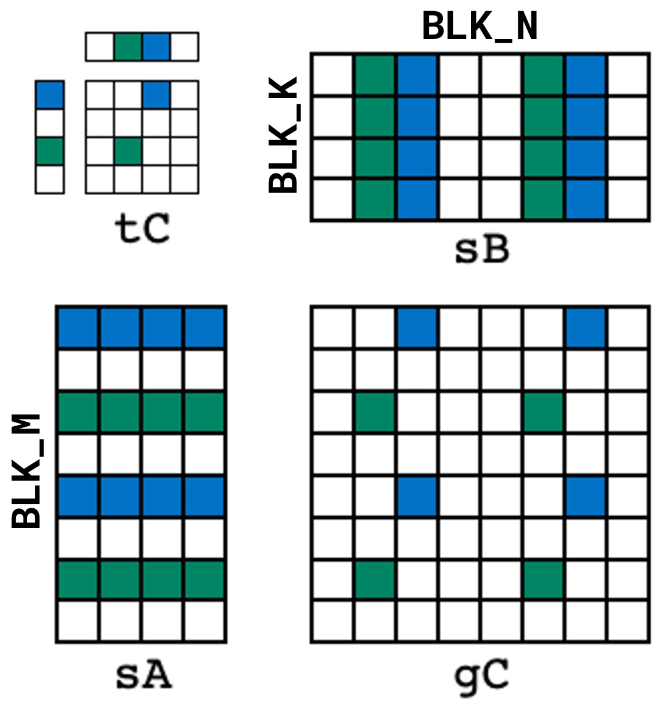
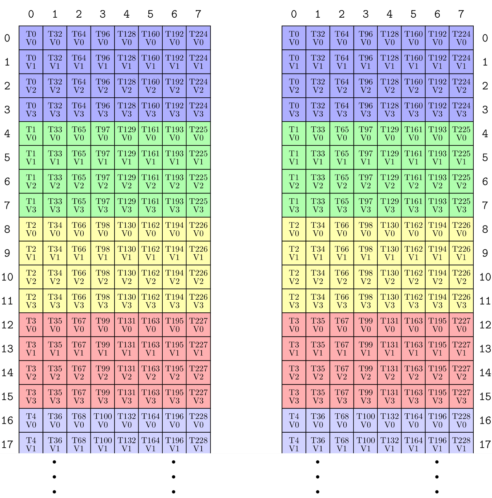
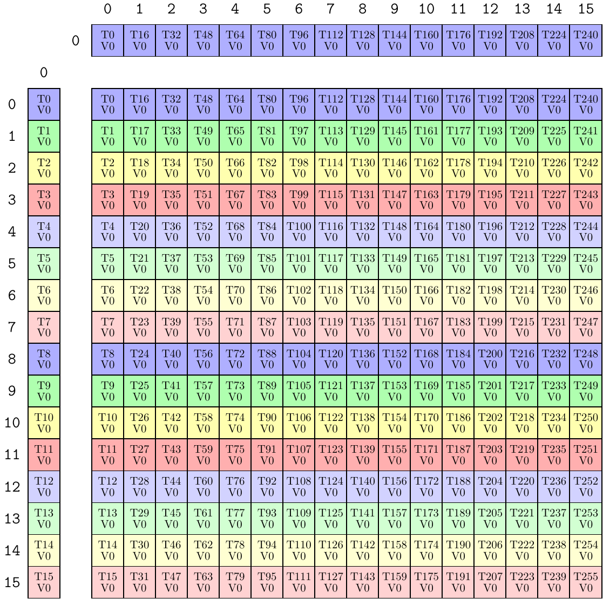

# CuTe 稠密矩阵乘法教程（CuTe Dense Matrix-Matrix Multiply Tutorial）

原文：<https://docs.nvidia.com/cutlass/latest/media/docs/cpp/cute/0x_gemm_tutorial.html>

本文围绕 [这些示例](https://github.com/NVIDIA/cutlass/tree/main/examples/cute/tutorial/) 展开，它们展示了如何只依赖 CuTe，编写若干自包含（single-file）的稠密矩阵乘法（dense matrix-matrix multiply）实现。

## `sgemm_1.cu`

这是最基础的一版示例，覆盖了几个核心步骤：

- 如何把全局内存（global memory）按 CTA / threadblock 切成 tile
- 如何把每个 CTA 内的数据 tile 再分到各个线程
- 如何用 `cute::copy` 和 `cute::gemm` 写出一个最简单的主循环（mainloop）

### 高层接口（High-level Interface）

先看 kernel 入口 `gemm_device`：

```c++
template <class ProblemShape, class CtaTiler,
          class TA, class AStride, class ASmemLayout, class AThreadLayout,
          class TB, class BStride, class BSmemLayout, class BThreadLayout,
          class TC, class CStride, class CSmemLayout, class CThreadLayout,
          class Alpha, class Beta>
__global__ static
__launch_bounds__(decltype(size(CThreadLayout{}))::value)
void
gemm_device(ProblemShape shape_MNK, CtaTiler cta_tiler,
            TA const* A, AStride dA, ASmemLayout sA_layout, AThreadLayout tA,
            TB const* B, BStride dB, BSmemLayout sB_layout, BThreadLayout tB,
            TC      * C, CStride dC, CSmemLayout          , CThreadLayout tC,
            Alpha alpha, Beta beta)
```

模板参数很多，但它们大体可以分成几类：

- `ProblemShape`：这次 GEMM 的整体问题规模，也就是 `(M,N,K)`
- `CtaTiler`：决定每个 CTA 从全局问题中切哪一块 tile
- `TA/TB/TC` 与 `A/B/C` 指针：A、B、C 的数据类型与基地址
- `AStride/BStride/CStride`：A、B、C 对应的 stride
- `ASmemLayout/BSmemLayout/CSmemLayout`：在共享内存中暂存 A/B/C tile 时采用的布局
- `AThreadLayout/BThreadLayout/CThreadLayout`：不同阶段数据如何分配给线程
- `alpha/beta`：最终执行 `C = alpha * A * B + beta * C` 的标量

### 完整张量：shape、stride 与数据（The Full Tensors）

大多数 GEMM 接口都按 `M, N, K` 给出问题规模。CuTe 也使用这一约定，只是把它们打包进一个 `IntTuple`：

```cpp
// Define shapes (dynamic)
auto M = int(m);
auto N = int(n);
auto K = int(k);
auto prob_shape = make_shape(M, N, K);    // (M, N, K)
```

进入 kernel 后，先做前置条件检查，然后构造完整矩阵：

```cpp
// Preconditions
CUTE_STATIC_ASSERT_V(rank(shape_MNK) == Int<3>{});                      // (M, N, K)

CUTE_STATIC_ASSERT_V(congruent(select<0,2>(shape_MNK), dA));            // dA strides for shape MK
CUTE_STATIC_ASSERT_V(congruent(select<1,2>(shape_MNK), dB));            // dB strides for shape NK
CUTE_STATIC_ASSERT_V(congruent(select<0,1>(shape_MNK), dC));            // dC strides for shape MN

// Represent the full tensors
Tensor mA = make_tensor(make_gmem_ptr(A), select<0,2>(shape_MNK), dA);  // (M,K)
Tensor mB = make_tensor(make_gmem_ptr(B), select<1,2>(shape_MNK), dB);  // (N,K)
Tensor mC = make_tensor(make_gmem_ptr(C), select<0,1>(shape_MNK), dC);  // (M,N)
```

这里最值得注意的是：CuTe 对 B 的语义是 `(N,K)`，而不是传统 BLAS 里常见的 `(K,N)`。这背后的出发点是：GEMM 的归约维始终是 `K`，把它固定在第二个 mode 上，有利于统一实现。

对应的 stride 定义，在 `gemm_nt` 中是：

```cpp
// Define NT strides (mixed)
auto dA = make_stride(Int<1>{}, ldA);    // (dM, dK)
auto dB = make_stride(Int<1>{}, ldB);    // (dN, dK)
auto dC = make_stride(Int<1>{}, ldC);    // (dM, dN)
```

而在 `gemm_tn` 中则是：

```cpp
// Define TN strides (mixed)
auto dA = make_stride(ldA, Int<1>{});    // (dM, dK)
auto dB = make_stride(ldB, Int<1>{});    // (dN, dK)
auto dC = make_stride(Int<1>{}, ldC);    // (dM, dN)
```

#### 题外话：M-major / N-major / K-major

文档专门强调了一点：BLAS 里的 “N/T” 标志（Not Transposed / Transposed）很容易把真正重要的问题搞混：

- 这个矩阵到底用了什么 layout？
- 它在哪个 mode 上 stride 为 1？

CuTe 更倾向于直接使用：

- **M-major**：M 方向 stride 为 1
- **N-major**：N 方向 stride 为 1
- **K-major**：K 方向 stride 为 1

并且统一采用 `MxK * NxK -> MxN` 这套语义。这样做的好处是：A 和 B 的 K 维始终都在同一个位置，代码里很多逻辑都能统一。

文档给出的对应关系如下：

| BLAS 记法 | A 的 majorness | A 的布局 | B 的 majorness | B 的布局 |
| --- | --- | --- | --- | --- |
| `NT` | M-major | `(M,K):(1,ldA)` | N-major | `(N,K):(1,ldB)` |
| `TN` | K-major | `(M,K):(ldA,1)` | K-major | `(N,K):(ldB,1)` |
| `NN` | M-major | `(M,K):(1,ldA)` | K-major | `(N,K):(ldB,1)` |
| `TT` | K-major | `(M,K):(ldA,1)` | N-major | `(N,K):(1,ldB)` |

不过在高层描述里，文档仍会沿用 BLAS 风格的 `NT` / `TN` 说法。

### CTA 分块（CTA Partitioning）

有了完整矩阵之后，下一步就是把它们切成 CTA 负责的 tile。

在这份教程里，CTA tile 直接用一个 shape 来表示：

```cpp
// Define CTA tile sizes (static)
auto bM = Int<128>{};
auto bN = Int<128>{};
auto bK = Int<  8>{};
auto cta_tiler = make_shape(bM, bN, bK);  // (BLK_M, BLK_N, BLK_K)
```

然后，根据当前 CTA 在 grid 中的位置，提取出属于它的 A / B / C 子张量：

```cpp
// Get the appropriate blocks for this threadblock
auto cta_coord = make_coord(blockIdx.x, blockIdx.y, _);              // (m,n,k)
Tensor gA = local_tile(mA, cta_tiler, cta_coord, Step<_1, X,_1>{});  // (BLK_M,BLK_K,k)
Tensor gB = local_tile(mB, cta_tiler, cta_coord, Step< X,_1,_1>{});  // (BLK_N,BLK_K,k)
Tensor gC = local_tile(mC, cta_tiler, cta_coord, Step<_1,_1, X>{});  // (BLK_M,BLK_N)
```

`cta_coord` 的含义是：

- `blockIdx.x` 指定 M 方向 tile 编号
- `blockIdx.y` 指定 N 方向 tile 编号
- K 方向保留为 `_`，因为一个 CTA 会沿 K 方向遍历多个 tile 做归约

`local_tile` 可以看作两个步骤的组合：

1. 先用 tiler 对整个 tensor 做 `zipped_divide`
2. 再用当前 CTA 的坐标，从“rest-mode”里切出对应 tile

例如，对于 A：

```cpp
// ((BLK_M,BLK_K),(m,k))
Tensor gA_mk = zipped_divide(mA, select<0,2>(cta_tiler));

// (BLK_M,BLK_K,k)
Tensor gA = gA_mk(make_coord(_,_), select<0,2>(cta_coord));
```

因此，`gA` 最终是一个 shape 为 `(BLK_M, BLK_K, k)` 的 rank-3 tensor。前两个 mode 是当前 CTA 的 tile，最后一个 mode 用来遍历该 CTA 需要归约的所有 K-tile。

### 共享内存张量（SMEM Tensors）

接下来，需要为 A 和 B 在共享内存中准备暂存 tile 的布局。它们会通过 `ASmemLayout` / `BSmemLayout` 参数传入。

对 `gemm_nt`，共享内存布局定义为：

```cpp
// Define the smem layouts (static)
auto sA = make_layout(make_shape(bM, bK));   // (m,k) -> smem_idx; m-major
auto sB = make_layout(make_shape(bN, bK));   // (n,k) -> smem_idx; n-major
```

对 `gemm_tn`，则改成：

```cpp
// Define the smem layouts (static)
auto sA = make_layout(make_shape(bM,bK), LayoutRight{});   // (m,k) -> smem_idx; k-major
auto sB = make_layout(make_shape(bN,bK), LayoutRight{});   // (n,k) -> smem_idx; k-major
```

文档强调：共享内存布局其实可以非常自由。内核里只要求两件事：

1. 这些 layout 必须是静态的（static）
2. 它们的顶层 shape 要与 `cta_tiler` 对应

```cpp
static_assert(is_static<ASmemLayout>::value);
static_assert(is_static<BSmemLayout>::value);
static_assert(is_static<CSmemLayout>::value);

CUTE_STATIC_ASSERT_V(size<0>(ASmemLayout{}) == size<0>(cta_tiler));  // BLK_M
CUTE_STATIC_ASSERT_V(size<0>(CSmemLayout{}) == size<0>(cta_tiler));  // BLK_M
CUTE_STATIC_ASSERT_V(size<0>(BSmemLayout{}) == size<1>(cta_tiler));  // BLK_N
CUTE_STATIC_ASSERT_V(size<1>(CSmemLayout{}) == size<1>(cta_tiler));  // BLK_N
CUTE_STATIC_ASSERT_V(size<1>(ASmemLayout{}) == size<2>(cta_tiler));  // BLK_K
CUTE_STATIC_ASSERT_V(size<1>(BSmemLayout{}) == size<2>(cta_tiler));  // BLK_K
```

静态 layout 的好处包括：

- 可以直接静态分配共享内存
- 更容易触发 CuTe 的优化实现
- 更容易做正确性检查

有了静态共享内存 layout，kernel 就能这样分配共享内存并构造对应 tensor：

```cpp
// Shared memory buffers
__shared__ TA smemA[cosize_v<ASmemLayout>];
__shared__ TB smemB[cosize_v<BSmemLayout>];
Tensor sA = make_tensor(make_smem_ptr(smemA), sA_layout);  // (BLK_M,BLK_K)
Tensor sB = make_tensor(make_smem_ptr(smemB), sB_layout);  // (BLK_N,BLK_K)
```

这里用到了 `cosize`。由于 `Layout` 是函数，所以可以谈它的定义域（domain）和余域（codomain）：

- `size(layout)`：定义域大小
- `cosize(layout)`：余域大小

如果要分配一块数组，使 layout 产生的所有 offset 都合法，那么数组长度就至少应该是 `cosize(layout)`。

### Copy 分区（Copy Partitioning）

现在 kernel 已经有了：

- 全局内存里的 CTA tile：`gA` / `gB`
- 共享内存里的目标 tile：`sA` / `sB`

接下来要解决的问题是：如何高效地把 global tile 复制到 shared tile。

最朴素的方案是：只用一个线程，逐元素复制：

```cpp
if (thread0()) {
  Tensor gA0 = gA(_,_,0);  // (BLK_M,BLK_K), the 0th tile
  for (int i = 0; i < size(sA); ++i) {
    sA(i) = gA0(i);
  }
}
```

显然这太浪费线程了。

更自然的做法是：把 tile 再按线程做 partition，让每个线程只负责自己的 subtensor。

在 `gemm_nt` 中，线程布局定义为：

```cpp
// Define thread layouts (static)
auto tA = make_layout(make_shape(Int<32>{},Int<8>{}));   // (m,k) -> thr_idx
auto tB = make_layout(make_shape(Int<32>{},Int<8>{}));   // (n,k) -> thr_idx
```

而在 `gemm_tn` 中则用 K-major 线程布局：

```cpp
// Define thread layouts (static)
auto tA = make_layout(make_shape(Int<32>{},Int<8>{}), LayoutRight{});  // (m,k) -> thr_idx; k-major
auto tB = make_layout(make_shape(Int<32>{},Int<8>{}), LayoutRight{});  // (n,k) -> thr_idx; k-major
```

这两种情况下，线程总数都是 `32 x 8`，用于把一个 `128x8` 的 tile 切成“每线程一个 `4x1` subtensor”。

内核会检查这些布局是否满足整除关系：

```cpp
static_assert(is_static<AThreadLayout>::value);
static_assert(is_static<BThreadLayout>::value);

CUTE_STATIC_ASSERT_V(size(tA) == size(tB));                          // NumThreads

CUTE_STATIC_ASSERT_V(size<0>(cta_tiler) % size<0>(tA) == Int<0>{});  // BLK_M / THR_M
CUTE_STATIC_ASSERT_V(size<2>(cta_tiler) % size<1>(tA) == Int<0>{});  // BLK_K / THR_K
CUTE_STATIC_ASSERT_V(size<1>(cta_tiler) % size<0>(tB) == Int<0>{});  // BLK_N / THR_N
CUTE_STATIC_ASSERT_V(size<2>(cta_tiler) % size<1>(tB) == Int<0>{});  // BLK_K / THR_K
```

随后，用这些线程布局对 global / shared tensor 做 partition：

```cpp
Tensor tAgA = local_partition(gA, tA, threadIdx.x);    // (THR_M,THR_K,k)
Tensor tAsA = local_partition(sA, tA, threadIdx.x);    // (THR_M,THR_K)

Tensor tBgB = local_partition(gB, tB, threadIdx.x);    // (THR_N,THR_K,k)
Tensor tBsB = local_partition(sB, tB, threadIdx.x);    // (THR_N,THR_K)
```

命名 `tAsA` 的惯例可以读作：

> “把分区模式 `tA` 作用在 tensor `sA` 上得到的结果”

通过对 `gA` 和 `sA` 使用同一个 partitioning pattern，我们就能保证它们在逻辑上逐元素对应，即使底层数据布局不同。这一点对 `cute::copy` 尤其关键。

此时，每个线程就可以独立执行：

```cpp
copy(tAgA(_,_,0), tAsA);
```

因为每个线程拿到的是不同的 subtensor。

### 计算分区（Math Partitioning）

接着要解决的是：如何让 CTA 中的多个线程协作完成当前 tile 的矩阵乘法。

最简单但最差的方案同样是只用一个线程：

```cpp
if (thread0()) {
  for (int m = 0; m < size<0>(gC); ++m) {
    for (int n = 0; n < size<1>(gC); ++n) {
      for (int k = 0; k < size<1>(sA); ++k) {
        gC(m,n) += sA(m,k) * sB(n,k);
      }
    }
  }
}
```

更好的做法，是按线程把输出 tile `gC` 分开，让每个线程负责自己的输出 subtensor，并只读取与自己对应的 `sA` / `sB` 子块。

这里定义一个新的线程布局 `tC`：

```cpp
// Define thread layouts (static)
auto tC = make_layout(make_shape(Int<16>{}, Int<16>{}));   // (m,n) -> thr_idx; m-major
```

这是一个 `16x16` 的线程布局，会把 `128x128` 的 C tile 分给线程，使得每个线程最终计算自己的 `8x8` subtensor。

对应的 partition 代码如下：

```cpp
// Partition sA (M,K) by the rows of tC
Tensor tCsA = local_partition(sA, tC, threadIdx.x, Step<_1, X>{});   // (THR_M,BLK_K)
// Partition sB (N,K) by the cols of tC
Tensor tCsB = local_partition(sB, tC, threadIdx.x, Step< X,_1>{});   // (THR_N,BLK_K)
// Partition gC (M,N) by the tile of tC
Tensor tCgC = local_partition(gC, tC, threadIdx.x, Step<_1,_1>{});   // (THR_M,THR_N)

// Allocate the accumulators -- same shape/layout as the partitioned data
Tensor tCrC = make_tensor_like(tCgC);                                // (THR_M,THR_N)
```

它们之间的关系如下图所示：



现在，每个线程已经拿到了：

- 自己负责的 A 子块 `tCsA`
- 自己负责的 B 子块 `tCsB`
- 自己负责写回的 C 子块 `tCgC`
- 自己的寄存器累加器 `tCrC`

因此，所有线程都可以直接执行：

```cpp
gemm(tCsA, tCsB, tCrC);
```

### 主循环（Mainloop）

主循环的职责非常清晰：

1. 依次遍历 K 方向的 tile
2. 把当前 K-tile 从 global memory 复制到 shared memory
3. 对当前 K-tile 做 GEMM
4. 把结果累加到寄存器累加器中

代码如下：

```c++
// TUTORIAL: Example of a very simple compute mainloop
//   copy(.) operates on the global and shared memory via the tA|tB partitioning
//   gemm(.) operates on the shared and register memory via the tC partitioning

auto K_TILE_MAX = size<2>(tAgA);

for (int k_tile = 0; k_tile < K_TILE_MAX; ++k_tile)
{
  // Copy gmem to smem with tA|tB thread-partitioned tensors
  copy(tAgA(_,_,k_tile), tAsA);      // A   (THR_M,THR_K) -> (THR_M,THR_K)
  copy(tBgB(_,_,k_tile), tBsB);      // B   (THR_N,THR_K) -> (THR_N,THR_K)

  cp_async_fence();        // Label the end of (potential) cp.async instructions
  cp_async_wait<0>();      // Sync on all (potential) cp.async instructions
  __syncthreads();         // Wait for all threads to write to smem

  // Compute gemm on tC thread-partitioned smem
  gemm(tCsA, tCsB, tCrC);            // (THR_M,THR_N) += (THR_M,BLK_K) * (THR_N,BLK_K)
  __syncthreads();         // Wait for all threads to read from smem
}
```

这就是最基础版 GEMM kernel 的完整骨架。

## `sgemm_2.cu`

第二个示例开始使用更强的 `TiledCopy` 和 `TiledMMA` 来替代前面手工写的 `tA`、`tB`、`tC` 线程布局。

这个版本的重点在于：

> 共享内存布局、线程分区模式、底层 PTX 指令，可以彼此独立指定。

### `TiledCopy`

先看 `gemm_nt` 中构造的 `TiledCopy`：

```cpp
TiledCopy copyA = make_tiled_copy(Copy_Atom<UniversalCopy<uint128_t>, TA>{},  // Atom: Copy TAs as if they were uint128_t
                                  Layout<Shape<_32,_8>>{},                    // Thr layout 32x8 m-major
                                  Layout<Shape< _4,_1>>{});                   // Val layout  4x1 m-major
print_latex(copyA);
```

图示如下：



这张图告诉我们：

- 有 `32x8` 个线程
- 每个线程读取 `4x1` 个 `TA` 元素
- `UniversalCopy<uint128_t>` 强制它按 128-bit 拷贝来做

如果当前 partition 不能被合法向量化成一个 128-bit load/store，CuTe 会在编译期直接报错。

使用方法也很直接：

```cpp
ThrCopy thr_copy_a = copy_a.get_slice(threadIdx.x);
Tensor tAgA = thr_copy_a.partition_S(gA);            // (CPY,CPY_M,CPY_K,k)
Tensor tAsA = thr_copy_a.partition_D(sA);            // (CPY,CPY_M,CPY_K)
// Allocate registers same shape/layout as partitioned data
Tensor tArA = make_fragment_like(tAsA);              // (CPY,CPY_M,CPY_K)
```

其中：

- `partition_S`：对源张量做分区
- `partition_D`：对目标张量做分区
- 第一维 `CPY`：表示一次底层 copy 指令会消费的元素组

准备好之后就可以执行：

```cpp
cute::copy(copy_a, tAgA, tArA);
```

### `TiledMMA`

接着，用 `TiledMMA` 替换前面的 `tC` 分区。

先看 `gemm_nt` 里构造的 `TiledMMA`：

```cpp
TiledMMA mmaC = make_tiled_mma(UniversalFMA<TC,TA,TB>{},
                               Layout<Shape<_16,_16,_1>>{});  // 16x16x1 UniversalFMA
print_latex(mmaC);
```

图示如下：



由于 `UniversalFMA` 是一个 `1x1x1` 的 MMA 指令，所以把它按 `16x16x1` 方式平铺之后，就形成了一个 `16x16x1` 的 `TiledMMA`。对于更复杂的真正硬件 MMA 指令，线程和指令粒度都会发生变化。

使用方式如下：

```cpp
ThrMMA thr_mma = mma.get_slice(threadIdx.x);
Tensor tCsA = thr_mma.partition_A(sA);        // (MMA,MMA_M,MMA_K)
Tensor tCsB = thr_mma.partition_B(sB);        // (MMA,MMA_N,MMA_K)
Tensor tCgC = thr_mma.partition_C(gC);        // (MMA,MMA_M,MMA_N)
// Allocate the accumulators -- same size as the projected data
Tensor tCrC = thr_mma.make_fragment_C(tCgC);  // (MMA,MMA_M,MMA_N)
```

然后执行：

```cpp
cute::gemm(mma, tCsA, tCsB, tCrC);
```

与 `TiledCopy` 一样，真正的 PTX 指令、逻辑分区形状、线程切片方式，都被统一封装进了更高层接口里。

### 其他变化（Other Changes）

这一版里，`gemm_tn` 的共享内存布局也做了改动。之前用的是纯 K-major，现在改成“带 padding 的 M-major / N-major”：

```cpp
// Define the smem layouts (static)
auto sA = make_layout(make_shape (      bM,          bK),
                      make_stride(Int<1>{}, bM+Int<1>{}));  // (m,k) -> smem_idx; padded m-major
auto sB = make_layout(make_shape (      bN,          bK),
                      make_stride(Int<1>{}, bN+Int<1>{}));  // (n,k) -> smem_idx; padded n-major
```

这样做的目的很明确：改善共享内存的访问模式，尽量减少 bank conflict，并提高读写效率。kernel 的其余逻辑不需要改动。

## `sgemm_sm70.cu`

这是一个面向 Volta SM70 的优化版本，它使用了更高级的 mainloop，把共享内存与寄存器访问做成流水线（pipeline）。

## `sgemm_sm80.cu`

这是一个面向 Ampere SM80 的优化版本，它显式使用异步 global->shared 读取，并围绕此构建了共享内存流水线。

## 下一步（Next Steps）

前面的所有示例都默认：

> CTA tile 大小能够整除整个问题规模

也就是说，全局内存加载不需要做 predication。如果矩阵大小不能被 tile 整除，就需要引入谓词化。对应内容可参考 [`0y_predication.zh-CN.md`](./0y_predication.zh-CN.md)。

## 把 GETT 当成 GEMM（GETT as GEMM）

这里的 GETT 指 generalized tensor times tensor，也就是一种更一般的张量收缩（tensor contraction）。

CuTe 允许矩阵拥有嵌套的 `Layout`。因此，我们可以通过把多个 mode 分组，把一个更高阶 tensor 折叠（fold）成“矩阵”，然后继续复用 GEMM 实现。

文档最后给了一个例子：使用 `sgemm_1.cu` 里的同一个 `gemm_device` kernel，去计算一个拥有两个 M-mode 的 GETT。

核心代码如下：

```cpp
// Setup params for a GETT with two m-modes.
// The A and C tensors are assumed to be m0-major.
//   Calls sgemm_1.cu's gemm_device<<<>>> without modification.
template <class TA, class TB, class TC,
          class Alpha, class Beta>
void
gett(int m0, int m1, int n, int k,
     Alpha alpha,
     TA const* A, int ldAm1, int ldAk,  // m0-major
     TB const* B, int ldBk,
     Beta beta,
     TC      * C, int ldCm1, int ldCn,  // m0-major
     cudaStream_t stream = 0)
{
  using namespace cute;

  // Define shapes (dynamic)
  auto M = make_shape(m0, m1);                               // (m0,m1)-multimode M
  auto N = int(n);
  auto K = int(k);
  auto prob_shape = make_shape(M, N, K);                     // (M, N, K)

  // Define NT strides (mixed)
  auto dA = make_stride(make_stride(Int<1>{}, ldAm1), ldAk); // (dM, dK)
  auto dB = make_stride(Int<1>{}, ldB);                      // (dN, dK)
  auto dC = make_stride(make_stride(Int<1>{}, ldCm1), ldCn); // (dM, dN)

  // Define CTA tile sizes (static)
  auto bM = Shape<_64, _2>{};    // Take _64 elements from m0 and _2 elements from m1
  auto bN = Int<128>{};
  auto bK = Int<  8>{};
  auto cta_tiler = make_shape(bM, bN, bK);                   // (BLK_M, BLK_N, BLK_K)

  // Define the smem layouts (static)
  auto sA = make_layout(make_shape(bM, bK));                 // (m,k) -> smem_idx; m-major
  auto sB = make_layout(make_shape(bN, bK));                 // (n,k) -> smem_idx; n-major
  auto sC = make_layout(make_shape(bM, bN));                 // (m,n) -> smem_idx; m-major

  // Define the thread layouts (static)
  auto tA = make_layout(make_shape(Int<32>{}, Int< 8>{}));   // (m,k) -> thr_idx
  auto tB = make_layout(make_shape(Int<32>{}, Int< 8>{}));   // (n,k) -> thr_idx
  auto tC = make_layout(make_shape(Int<16>{}, Int<16>{}));   // (m,n) -> thr_idx

  dim3 dimBlock(size(tC));
  dim3 dimGrid(size(ceil_div(M, bM)),
               size(ceil_div(N, bN)));
  gemm_device<<<dimGrid, dimBlock, 0, stream>>>
      (prob_shape, cta_tiler,
       A, dA, sA, tA,
       B, dB, sB, tB,
       C, dC, sC, tC,
       alpha, beta);
}
```

这段代码的关键点在于：为了把 GETT 复用到 GEMM kernel 上，真正变化的只有三件事：

1. `M` 的定义：从单整数变成了多 mode 的 `make_shape(m0, m1)`
2. `dA` 和 `dC` 的 stride 定义：需要体现两个 M-mode
3. CTA tiler 的 `bM`：从单整数变成了多 mode 的 `Shape<_64, _2>{}`

也就是说，`gemm_device` 自身完全不用修改，只要在外层把问题 shape 和 tile 方式换成“多 mode 的矩阵”，就可以把它推广到更一般的张量收缩。

文档还提到，CUTLASS 3.x 中不少基于 CuTe 的 kernel 也用了类似技巧，例如 [这个 Hopper GETT 示例](https://github.com/NVIDIA/cutlass/tree/main/examples/51_hopper_gett)。

## 版权（Copyright）

以下 BSD-3-Clause 许可证文本保留原文：

Copyright (c) 2017 - 2026 NVIDIA CORPORATION & AFFILIATES. All rights reserved. SPDX-License-Identifier: BSD-3-Clause

```console
  Redistribution and use in source and binary forms, with or without
  modification, are permitted provided that the following conditions are met:

  1. Redistributions of source code must retain the above copyright notice, this
  list of conditions and the following disclaimer.

  2. Redistributions in binary form must reproduce the above copyright notice,
  this list of conditions and the following disclaimer in the documentation
  and/or other materials provided with the distribution.

  3. Neither the name of the copyright holder nor the names of its
  contributors may be used to endorse or promote products derived from
  this software without specific prior written permission.

  THIS SOFTWARE IS PROVIDED BY THE COPYRIGHT HOLDERS AND CONTRIBUTORS "AS IS"
  AND ANY EXPRESS OR IMPLIED WARRANTIES, INCLUDING, BUT NOT LIMITED TO, THE
  IMPLIED WARRANTIES OF MERCHANTABILITY AND FITNESS FOR A PARTICULAR PURPOSE ARE
  DISCLAIMED. IN NO EVENT SHALL THE COPYRIGHT HOLDER OR CONTRIBUTORS BE LIABLE
  FOR ANY DIRECT, INDIRECT, INCIDENTAL, SPECIAL, EXEMPLARY, OR CONSEQUENTIAL
  DAMAGES (INCLUDING, BUT NOT LIMITED TO, PROCUREMENT OF SUBSTITUTE GOODS OR
  SERVICES; LOSS OF USE, DATA, OR PROFITS; OR BUSINESS INTERRUPTION) HOWEVER
  CAUSED AND ON ANY THEORY OF LIABILITY, WHETHER IN CONTRACT, STRICT LIABILITY,
  OR TORT (INCLUDING NEGLIGENCE OR OTHERWISE) ARISING IN ANY WAY OUT OF THE USE
  OF THIS SOFTWARE, EVEN IF ADVISED OF THE POSSIBILITY OF SUCH DAMAGE.
```
