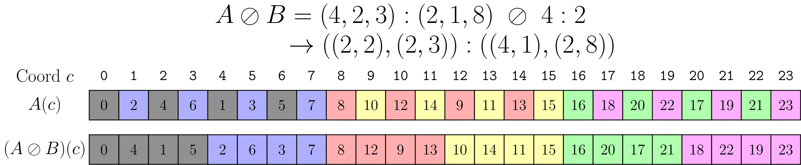
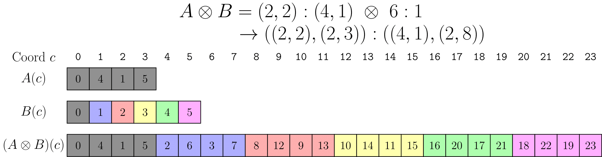
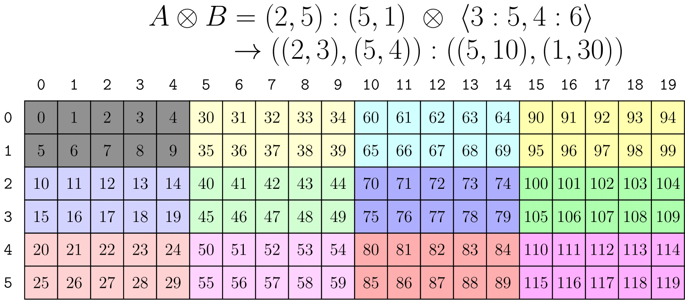
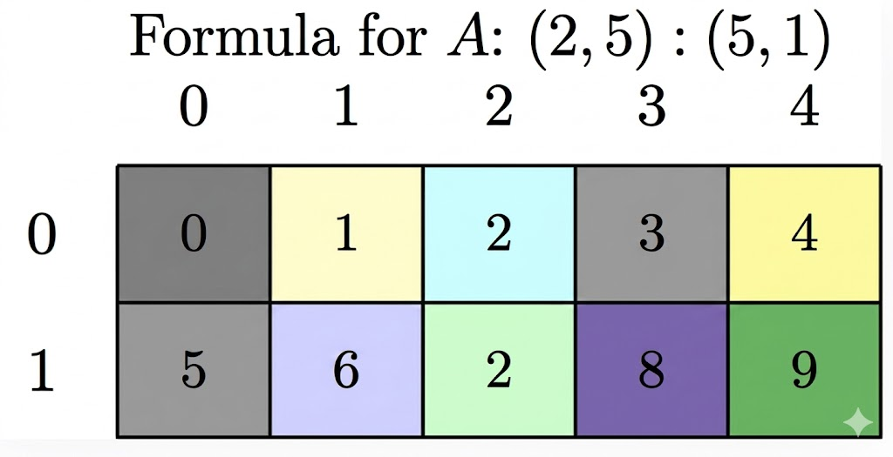
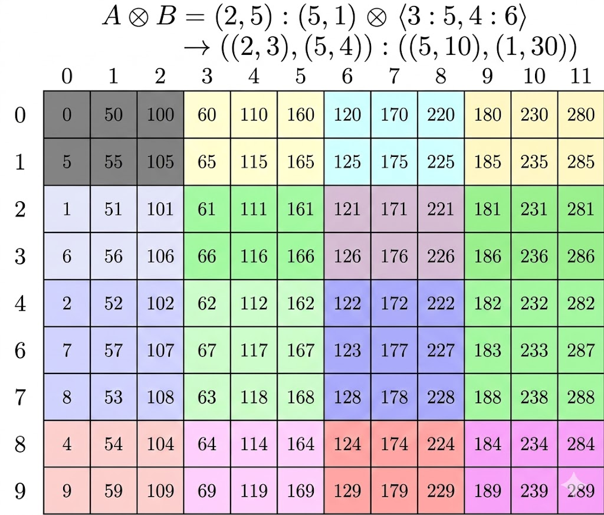
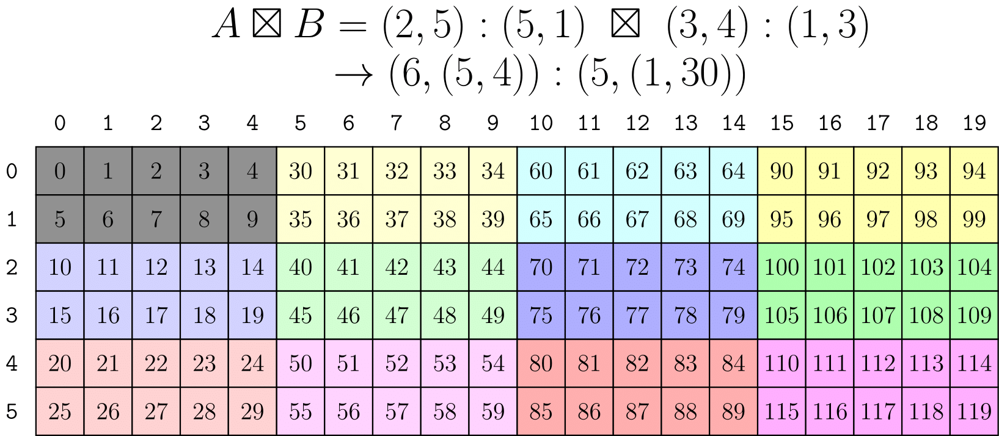
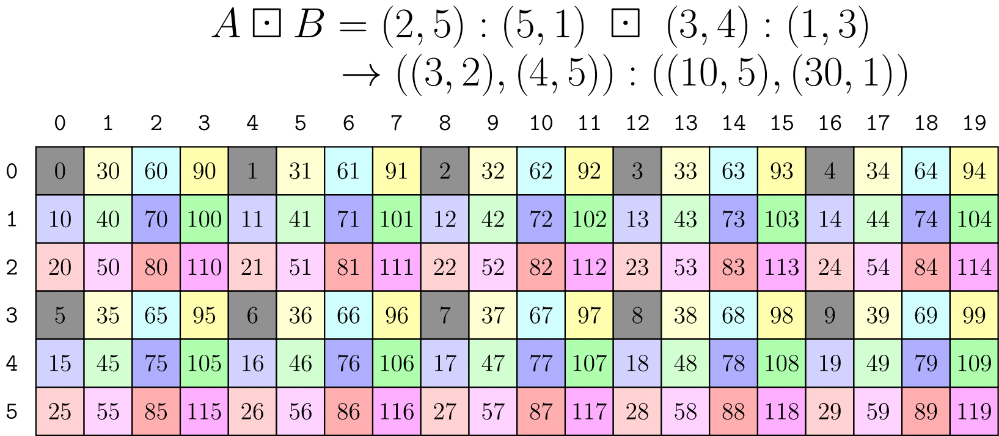

# 1. 概述

cute提供了一整套的 `layout` 代数用来以不同方式组成 `layout`。下面介绍几种常用的代数运算。

# 2. Coalesce

在[layout入门](./hello-cute01：cute概述及layout入门.md#从逻辑坐标到线性索引)中我们可以看到，其实 `layout` 本质上就是从整数到整数的函数，而 `coalesce` 可以理解为一种化简操作，重写 `layout` 的 `shape` 和 `mode` 数量。
例如：
```cpp
auto layout = Layout<Shape <_2,Shape <_1,_6>>,
                     Stride<_1,Stride<_6,_2>>>{};
auto result = coalesce(layout);    // _12:_1
```
结果 `mode` 更小，也更简单。

`coalesce` 的规则可以归纳为四种情况。设两个相邻 `mode` 是 `s0:d0` 和 `s1:d1`：

1. `s0:d0 ++ _1:d1 => s0:d0`  
   大小为静态 1 的 mode 可以忽略。
2. `_1:d0 ++ s1:d1 => s1:d1`  
   同理，静态 1 的 mode 可以忽略。
3. `s0:d0 ++ s1:(s0*d0) => (s0*s1):d0`  
   如果第二个 mode 的 stride 恰好等于第一个 mode 的 size 与 stride 的乘积，这两个 mode 就能合并。
4. `s0:d0 ++ s1:d1 => (s0,s1):(d0,d1)`  
   其余情况不能合并，只能保留。

因此，对任意 `layout`，把相邻 `mode` 按上面的二元规则依次合并，就能得到 `coalesced` 结果。

## 按 `mode` 的 `coalesce`

有时候我们想控制 `coalesce` 的粒度，即不要总是 `coalesce` 整个 `layout`，而是只 `coalesce` 某些 `mode`。cute为这种需求提供了一个带额外 `IntTuple` 参数的重载：

```cpp
// Apply coalesce at the terminals of trg_profile
Layout coalesce(Layout const& layout, IntTuple const& trg_profile)
```

示例：

```cpp
auto a = Layout<Shape <_2,Shape <_1,_6>>,
                Stride<_1,Stride<_6,_2>>>{};
auto result = coalesce(a, Step<_1,_1>{});   // (_2,_6):(_1,_2)
// Identical to
auto same_r = make_layout(coalesce(layout<0>(a)),
                          coalesce(layout<1>(a)));
```

这里的`Step<_1,_1>{}`中的 `_1` 不是指代位置而是一个 `flag`，表示 `_1` 占据的 `mode` 需要 `coalesce`，至于 `stride` 的大小为什么是 `(_1, _2)`，请见上面的 `coalesce` 规则。

# Composition

在[coalesce](./hello-cute02：layout的代数运算.md#2-coalesce)中我们说过 `layout` 就是从整数到整数的函数，既然是函数那么当然可以复合。例如 `f(x)` 与 `g(y)` 都是函数，`f(x)` 的值域没有超过 `g(y)` 的定义域，那么可以定义一个新的函数 `h(x) = g(f(x))`，这就是 `composition`。
类似的，在 `layout` 中我们可以定义

`R := A o B`

为：

`R(c) := A(B(c))`

其中 `A` 和 `B` 是两个 `layout`，`R` 是复合后的 `layout`。文档给出的一个例子是：

```text
A = (6,2):(8,2)
B = (4,3):(3,1)
```

对这个例子做复合后，可以得到一个新的 `Layout`：

```console
R = ((2,2),3):((24,2),8)
```

## 如何计算Composition

这里有两个重要观察：

- 一个 layout 可以被看成子布局的拼接：`B = (B_0, B_1, ...)`
- 当 `B` 是单射（injective，不同的输入一定会产生不同的输出）时，`composition` 对拼接是左分配的：  
  `A o (B_0, B_1, ...) = (A o B_0, A o B_1, ...)`

于是，只需要先处理最简单的情况：假设 `B = s:d` 是一个“`shape` 和 `stride` 都是整数”的 `layout`，并把 `A` 视为已经 `flatten` 且 `coalesce` 过的 `layout`。

如果 `A = a:b` 本身就是一维整数 `layout`，那么结论非常简单：

`A o B = a:b o s:d = s:(b*d)`

意思就是：在 `A` 中按步长 `d` 取前 `s` 个元素。

详细解释一下这里为什么 `a:b o s:d = s:(b*d)`，因为这是理解后面多 `mode` 的 `composition` 的基础。

从数学上理解，回到 **`composition` 的定义** 和 **`layout` 作为函数** 的含义。
首先 `Layout` 是一个函数，即
一个一维整数 `layout`，也就是 `a:b`，表示一个函数：

$$
A(i) = b \times i \quad (i = 0, 1, \dots, a-1)
$$

其中 `a` 是 `shape`（元素个数），`b` 是 `stride`（步长）。

同样，`B = s:d` 表示：

$$
B(j) = d \times j \quad (j = 0, 1, \dots, s-1)
$$

$$
(A \circ B)(j) = A(B(j))
$$

把 `A = a:b` 和 `B = s:d` 代入：

$$
(A \circ B)(j) = A(B(j)) = A(d \times j) = b \times (d \times j) = (b \times d) \times j
$$

所以结果是一个新函数：输入 `j`，输出 `(b*d) * j`。

这个函数对应的 `layout` 就是 **`s:(b*d)`**：

- **shape 是 `s`**：因为 `B` 的定义域是 `{0, 1, ..., s-1}`，`composition` 的结果要和 `B` 兼容，所以元素个数由 `B` 决定，是 `s`。
- **stride 是 `b*d`**：因为步长嵌套了——先在 `B` 中每步跨 `d`，再在 `A` 中每步跨 `b`，最终实际步长就是 `b * d`。

从直观上理解：

> "在 `A` 中按步长 `d` 取前 `s` 个元素"

可以这样想：

- `A = a:b` 是一个等间距排列的序列：`0, b, 2b, 3b, ...`
- `B = s:d` 说的是"从中每隔 `d` 个位置取一个，取 `s` 个"
- 所以结果就是：`A(0), A(d), A(2d), ...` = `0, b*d, 2*b*d, ...`
- 这正好对应 `s:(b*d)` 这个 `layout`

OK理解了 `A` 是一维整数 `layout` 的情况，下面我们来看多 `mode` 的情况。

如果 `A` 是多 mode 的，那么要分成两步看：

1. 先求一个“步进后的 A”，它保留 `A` 中每隔 `d` 个取一个元素的结果。  
   这一步相当于从左到右不断把 `A` 的 shape 拿去“除以 `d`”。
2. 再从这个步进后的 `layout` 中保留前 `s` 个元素，使结果 `shape` 与 `B` 兼容。  
   这一步相当于从左到右不断把 `shape` “对 `s` 取模”。

文档把这两个前提分别称为：

- `stride divisibility condition`
- `shape divisibility condition`

其实文档的这种说法没有给出直接的计算方式，我把 `composition` 的计算方式归纳为以下流程：

1. 如果B是多mode的，按照左分配的规则分配给A，例如(10,2):(16,4) o (5,4):(1,5)，B可拆分为(5:1)和(4:5)，然后分配给A，得到(10,2):(16,4) o 5:1和(10,2):(16,4) o 4:5；
2. 对于左分配得到的每一个composition，A中的shape去除以B的stride，这里要说明，shape中的数字除以（或除）stride的数字如果不能整除是不合法的！cute会在编译期报错，例如(7,4)/4或者(3,4)/4都是不合法的。对于合法的除法，如果shape中的值比stride大例如(8,3) / 4，则直接得到结果(2,3)，如果更小则小的shape对应的维度变为1，剩余的除数 d 变为 d/shape，然后再在下一维进行除法，例如(2, 8) / 4，2比4小，则第一维变为1，同时stride变为4/2=2，下一维则是8/2=4，所以得到(1,4)；
3. 在2中我们算出了composition后的shape，stride即为之前的stride乘上原来的shape缩小的倍数，例如在2中(2,8):(1,3) o 3:4，得到的shape为(1,4)，分别缩小了2和2倍，则stride变为(1,3)*(2,2)=(2,6)；
4. 最后还要兼容B的shape（相当于把定义域缩小到B），即取前B的shape个结果，例如经过3我们得到(1,4):(2,6)，B的shape为3，则取前3个结果，得到(1,3):(2,6)。如果前面的维度小于要取的size，则前面的维度不变，修改后面的维度。最后的shape的size要和B的size一致。
5. 为了简略结果经过4后可以再做coalesce，但是不做也不影响正确性

接下来是几个文档中的几个例子：

例1：

```text
A = (6,2):(8,2)
B = (4,3):(3,1)
```

先利用“拼接 + 左分配”把它拆开：

```text
R = A o B
  = (6,2):(8,2) o (4,3):(3,1)
  = ((6,2):(8,2) o 4:3, (6,2):(8,2) o 3:1)
```

第一部分：

```text
(6,2):(8,2) o 4:3
```

- 先按 stride `3` 去“除”：  
  `(6,2):(8,2) / 3 = (2,2):(24,2)`
- 再保留和 `4` 兼容的 shape：  
  `(2,2):(24,2) % 4 = (2,2):(24,2)`

第二部分：

```text
(6,2):(8,2) o 3:1
```

- 按 stride `1` 去除，layout 不变
- 再保留前 `3` 个元素：  
  `(6,2):(8,2) % 3 = (3,1):(8,2)`

最后把两个结果拼起来，再适当做 coalesce，就得到：

```text
R = ((2,2),3):((24,2),8)
```

例 2：把一个 layout 重解释成矩阵

```text
20:2 o (5,4):(4,1)
```

这表示：把一维 layout `20:2` 按 row-major 的 `5x4` 方式解释成矩阵。

推导：

1. `(5,4):(4,1)` 看作 `(5:4, 4:1)` 的拼接
2. 分别做复合：
   - `20:2 o 5:4 => 5:8`
   - `20:2 o 4:1 => 4:2`
3. 拼接后得到 `(5:8, 4:2)`
4. 写成矩阵形式，即 `(5,4):(8,2)`

例 3：把一个多 mode layout 重解释成矩阵

```text
(10,2):(16,4) o (5,4):(1,5)
```

这表示：把 `(10,2):(16,4)` 以 column-major 的 `5x4` 方式去看。

主要步骤：

1. 把 `(5,4):(1,5)` 写成 `(5:1,4:5)`
2. 分别做复合：
   - `(10,2):(16,4) o 5:1 => (5,1):(16,4)`
   - `(10,2):(16,4) o 4:5 => (2,2):(80,4)`
3. 拼起来得到 `((5,1):(16,4), (2,2):(80,4))`
4. 做 by-mode coalesce 后得到更紧凑的：
   `(_5,(_2,_2)):(_16,(_80,_4))`

## 按 mode 的 Composition（By-mode Composition）

类似按-mode `coalesce`，有时我们不想把整个 `A` 当成单个一维函数，而是希望只对某些 `mode` 分别做 `composition`。

因此，`composition` 的第二个参数不一定非得是普通 `Layout`，也可以是一个 `Tiler`。在 CuTe 中，`tiler` 可以是：

- 一个 `Layout`
- 一个由 `Layout` 组成的 `tuple`

例如：

```cpp
// (12,(4,8)):(59,(13,1))
auto a = make_layout(make_shape (12,make_shape ( 4,8)),
                     make_stride(59,make_stride(13,1)));
// <3:4, 8:2>
auto tiler = make_tile(Layout<_3,_4>{},  // Apply 3:4 to mode-0
                       Layout<_8,_2>{}); // Apply 8:2 to mode-1

// (_3,(2,4)):(236,(26,1))
auto result = composition(a, tiler);
```

这等价于分别对 `a` 的两个 `mode` 做 `composition`，再把结果重新拼起来。

为了方便，CuTe 还允许把 `Shape` 直接当成 `tiler` 来用。此时，`Shape` 会被解释成“`stride` 全为 1 的 `tuple-of-layouts`”。

例如：

```cpp
auto tiler = make_shape(Int<3>{}, Int<8>{});
```

可以等价看成：

```cpp
// <3:1, 8:1>
```

对同一个 `a` 做 `composition` 后会得到：

```cpp
// (_3,(4,2)):(59,(13,1))
auto result = composition(a, tiler);
```

# Complement

在进入 `product` 和 `divide` 之前，还需要一个关键操作：`complement`。

如果把 `composition` 理解成“用布局 `B` 从布局 `A` 中选出某些坐标”，那么自然会问：那些没被选中的坐标去哪了？

为了实现通用 `tiling`，我们既要能描述“`tile` 本身”，也要能描述“`tile` 的重复方式”或“剩余布局（`rest`）”。`complement` 的作用就是：给定一个 `layout`，尝试找到另一个 `layout`，去表示那些“原 `layout` 没有覆盖到”的部分。

为什么说 `complement` 这种取补的操作可以得到 `tile` 的重复方式，例如 `size=24`，原来的 `layout` 为 `4:2`，既然一共是 `24` 的 `size`，那么除了现有的 `4` 之外还有 `20` 个的布局是怎么样的呢，或者说其他 `5` 个 `4:2` 的 `layout` 怎么布局的呢，`complement` 后的 `layout` 为 `(2,3):(1,8)`，就可以表示总共 `6` 个 `4:2` 的布局。

其接口可以写成：

```cpp
Layout complement(LayoutA const& layout_a, Shape const& cotarget)
```

其核心性质包括：

1. 结果 `R` 的 size / cosize 由 `cotarget` 的大小约束
2. `R` 是有序的，`stride` 为正且递增，因此结果唯一
3. `A` 与 `R` 的 codomain 彼此不重叠，`R` 尽量去“补满” `A` 的 codomain

`cotarget` 最常见的写法只是一个整数，例如 `24`。但有时把它写成带静态结构信息的 `Shape` 更有用，例如 `(_4,7)`。两者的大小都是 `28`，数学上给出的 `complement` 一样，但后者能让 CuTe 尽量保留更多静态信息。

下面是 `complement` 的计算流程

给定 `A` 这个 `layout` 有若干 `mode`：`(a₀, a₁, ...):(s₀, s₁, ...)`，以及一个整数 `M`（`cotarget`，表示目标总大小），`complement(A, M)` 的计算流程如下：

**第一步：将 `A` 的所有 `mode` 按 `stride` 从小到大排序**

得到排序后的序列 `(aᵢ, sᵢ)` 满足 `s₀ ≤ s₁ ≤ ...`

**第二步：初始化**

$$
c = 1 \quad \text{（当前已覆盖的步长游标）}
$$

准备一个空的结果 mode 列表 `R = []`

**第三步：从左到右遍历排序后的每个 mode `(aᵢ, sᵢ)`**

对每个 mode：

- 如果 `sᵢ / c > 1`，说明在当前游标 `c` 和这个 mode 的 stride 之间**有空隙**，需要补上：

$$
\text{往 R 中添加一个 mode：shape} = s_i / c, \quad \text{stride} = c
$$

- 更新游标：

$$
c \leftarrow s_i \times a_i
$$

**第四步：处理尾部**

遍历完所有 mode 后，如果 `M / c > 1`，说明还有剩余空间没被覆盖：

$$
\text{往 R 中添加一个 mode：shape} = M / c, \quad \text{stride} = c
$$

**第五步：输出 R**

如果 R 为空，返回 `1:0`（退化为单元素，表示已完全覆盖）。

---

可以把 `complement` 想象成在一维数轴 `[0, M)` 上"填空"：

- `A` 这个 `layout` 的每个 `mode` 按 `stride` 排序后，定义了一种"跳跃式"的覆盖模式
- 游标 `c` 记录"到目前为止已经被连续覆盖到的密度"
- 每遇到一个 `mode` `(aᵢ, sᵢ)`，如果 `sᵢ > c`，说明从 `c` 到 `sᵢ` 之间有空隙（没被 `A` 覆盖的位置），`complement` 就生成一个 `mode` 来**填满这些空隙**
- 最后如果 `c < M`，尾部还有空间没覆盖，也要补上

本质上就是：**`A` 跳过了哪些位置，`complement` 就去覆盖哪些位置，最终让 `A` 和 `complement` 拼起来恰好铺满 `[0, M)`。**

Complement 示例

下面假设所有整数都是静态整数：

- `complement(4:1, 24) = 6:4`  
  因为 `(4,6):(1,4)` 的 cosize 正好是 24。
- `complement(6:4, 24) = 4:1`  
  可以把 `6:4` 中的“洞”看成由 `4:1` 补上。
- `complement((4,6):(1,4), 24) = 1:0`  
  已经铺满，不需要额外补。
- `complement(4:2, 24) = (2,3):(1,8)`
- `complement((2,4):(1,6), 24) = 3:2`
- `complement((2,2):(1,6), 24) = (3,2):(2,12)`

# Division

现在可以定义一个 `Layout` 被另一个 `Layout` 去“除”的概念了。直观地说，`divide` 就是在做 `tiling` 和 `partitioning`。

CuTe 定义：

`logical_divide(A, B)`

它会把 `A` 分成两个 `mode`：

- 第一个 `mode`：`B` 选中的元素，也就是 `tile` 本身
- 第二个 `mode`：没有被 `B` 选中的其余部分，也就是这些 `tile` 的布局


形式上可以写成：

`A ⊘ B := A o (B, B*)`

其中 `B*` 是 `B` 相对于 `size(A)` 的 `complement`。

所以 `divide` 其实就是两件事情：

- `tiling`：把一个大的布局切成若干个大小相同的小块（`tile`）
- `partitioning`：`tile` 内部的坐标（`tile` 内的元素怎么排列）以及 `tile` 之间的坐标（`tile` 之间怎么排列）

一维 Divide 示例（Logical Divide 1-D Example）

设：

- `A = (4,2,3):(2,1,8)`
- `B = 4:2`

意思是：`A` 表示一个 `size` 为 `24` 的一维布局，而 `B` 表示“取 `4` 个元素，步长 `2`”的 `tile`。

计算过程：

1. `B = 4:2` 在 `size(A)=24` 下的 `complement` 是  
   `B* = (2,3):(1,8)`
2. 拼接 `(B, B*) = (4,(2,3)):(2,(1,8))`
3. 用 `A` 与它做 `composition`，得到：
   `((2,2),(2,3)):((4,1),(2,8))`

图示如下（图片来自官方文档，但是我觉得这图不好，它是用坐标来表示的，没有反映多维布局，下面的示例2更好）：



灰色部分是 `B` 这个 `tiler` 选中的 `tile`，其余颜色表示 `A` 中剩下的各个 `tile`。`divide` 之后，结果的第一个 `mode` 就是“`tile` 本体”，第二个 `mode` 则用来遍历这些 `tile`。

二维 Divide 示例（Logical Divide 2-D Example）

借助前面定义的 `Tiler` 概念，`divide` 可以自然推广到多维情形。

例如，一个二维 `layout`：

`A = (9,(4,8)):(59,(13,1))`

我们想在列方向应用 `3:3`，在行方向应用 `(2,4):(1,8)`。那么 `tiler` 可以写成：

`B = <3:3, (2,4):(1,8)>`

图示如下：


这里，每个 `mode` 的结果都被分成了两部分：

- 第一部分是 `tile` 的子布局
- 第二部分是这些 `tile` 的索引布局

特别地，结果中每个 `mode` 的第一部分，也就是子布局 `(3,(2,4)):(177,(13,2))`，恰好就是对原 `layout` 做 `composition(a, b)` 时会得到的内容。

其实这个示例可以看出 `divide` 的本质就是从原来的 `layout` 中按一定方式取出元素组成一个 `tile`，然后这个 `tile` 和剩余元素用相同方式组成的 `tile` 再按一定的布局形成新的 `layout`。
这里说的第一种方式，在例子2中，列方向 `divide 3:3`，相当于取 `3` 个元素，相邻元素之间的 `stride` 为 `3`，行方向为 `(2,4):(1,8)`，相当于取 `8` 个元素。这 `24` 个元素就组成了一个 `tile`（即图片中的灰色）。其他元素也按相同方式组成不同颜色的 `tile`。
第二种方式是指现在有不同的 `tile` 了，这些 `tile` 怎么排列。

## Zipped / Tiled / Flat Divide

虽然 `logical_divide` 的数学定义已经清楚，但直接使用时不一定方便。比如，你想取“第 3 个 `tile`”或者“第 `(1,2)` 个 `tile`”，更自然的形式往往是把 `tile` 本体和 `tile` 索引重组到更好用的 `mode` 里。

因此，CuTe 提供了几种方便形式：

```text
Layout Shape : (M, N, L, ...)
Tiler Shape  : <TileM, TileN>

logical_divide : ((TileM,RestM), (TileN,RestN), L, ...)
zipped_divide  : ((TileM,TileN), (RestM,RestN,L,...))
tiled_divide   : ((TileM,TileN), RestM, RestN, L, ...)
flat_divide    : (TileM, TileN, RestM, RestN, L, ...)
```

例如：

```cpp
// A: shape is (9,32)
auto layout_a = make_layout(make_shape (Int< 9>{}, make_shape (Int< 4>{}, Int<8>{})),
                            make_stride(Int<59>{}, make_stride(Int<13>{}, Int<1>{})));

auto tiler = make_tile(Layout<_3,_3>{},           // Apply     3:3     to mode-0
                       Layout<Shape <_2,_4>,      // Apply (2,4):(1,8) to mode-1
                              Stride<_1,_8>>{});

// ((TileM,RestM), (TileN,RestN)) with shape ((3,3), (8,4))
auto ld = logical_divide(layout_a, tiler);
// ((TileM,TileN), (RestM,RestN)) with shape ((3,8), (3,4))
auto zd = zipped_divide(layout_a, tiler);
```

此时：

- 第 3 个 `tile` 的偏移可以写成 `zd(0,3)`
- 第 7 个 `tile` 的偏移可以写成 `zd(0,7)`
- 第 `(1,2)` 个 `tile` 的偏移可以写成 `zd(0,make_coord(1,2))`

而 `tile` 本身总是 `layout<0>(zd)`。事实上，总有：

`layout<0>(zipped_divide(a, b)) == composition(a, b)`

`logical_divide` 会保留原始各 `mode` 的语义，只是重新排列每个 `mode` 内部的元素；`zipped_divide` 则更激进，它直接把“`tile` 本体”聚成一个 `mode`，把“`tile` 的索引布局”聚成另一个 `mode`。

其实 `logical_divide` 和 `zipped_divide` 的区别就是：`logical_divide` 的各 `mode` 的第一维表示一个 `tile` 的布局，第二维表示 `tile` 间的布局，而 `zipped_divide` 的第一个 `mode` 表示 `tile` 的布局，第二个 `mode` 表示 `tile` 间的布局

图示如下：


从这个视角看：

- 横向遍历一行，相当于遍历不同 `tile`
- 纵向遍历一列，相当于在一个 `tile` 内遍历元素

后面在 `Tensor` 分区时，这种结构会非常有用。

# Product（Tiling）

与 `divide` 相对，CuTe 也定义了 `Layout` 的 `product`。

直观地说：

`logical_product(A, B)`

会得到一个两 `mode` 的 `layout`：

- 第一个 `mode` 是 `A` 本身
- 第二个 `mode` 是“按 `B` 的方式，对 `A` 做唯一复制（unique replication）”后形成的布局

形式化写法：

`A ⊗ B := (A, A* o B)`


一维 Product 示例（Logical Product 1-D Example）

设：

- `A = (2,2):(4,1)`
- `B = 6:1`

这表示：`A` 是一个 `size` 为 `4` 的一维 `tile`，我们希望把它复制 `6` 次。

步骤如下：

1. 计算 `A` 在 `6*4 = 24` 下的 `complement`：  
   `A* = (2,3):(2,8)`
2. 计算 `A* o B`，结果仍是 `(2,3):(2,8)`
3. 拼接 `(A, A* o B)`，得到：  
   `((2,2),(2,3)):((4,1),(2,8))`

图示如下（这个图也不好，下面的图也不好，我会重新画一个）：



有趣的是，这个结果与前面的一维 `divide` 示例结果完全相同。

如果换一个 `B`，比如：

`B = (4,2):(2,1)`

那么 `tile` 的重复次数和排列顺序都会改变：


二维 Product 示例（Logical Product 2-D Example）

利用前面已经建立的 `by-mode tiler` 思路，`logical_product` 也可以推广到二维（这个官方的图其实是错的，显示的是 `block_product` 的结果）：



不过文档特别强调：**这不是推荐写法**。因为这里的 `B` 往往非常不直观，甚至需要你先完全了解 `A` 的 `shape` 与 `stride`，才能构造出一个合适的 `B`。

更自然的需求通常是：

> “按布局 `B` 去铺排布局 `A`”

并且希望 `A` 与 `B` 的写法彼此独立。

上面两个实例的图都不好，尤其是第二个，总感觉第二图是错误的，我重新画一下第二示例的图：

对于 `layoutA`，其为：



对于 `product` 的结果，其为：



从这两个图可以看出 `logical_product` 其实和 `logical_divide` 一样，各个 `mode` 的第一个维度是 `tile` 的布局，第二个维度是 `tile` 间的布局。

## Blocked Product 与 Raked Product

为了解决上面的问题（B不够直观），CuTe 提供了两个更常用的接口：

- `blocked_product(LayoutA, LayoutB)`
- `raked_product(LayoutA, LayoutB)`

它们是在一维 `logical_product` 之上的 `rank-sensitive` 封装。它们利用了 `logical_product` 的兼容性后置条件：

```console
// @post rank(result) == 2
// @post compatible(layout_a, layout<0>(result))
// @post compatible(layout_b, layout<1>(result))
```

既然 `A` 总和结果的 `mode-0` 兼容，`B` 总和结果的 `mode-1` 兼容，那么如果让 `A` 和 `B` 拥有相同的顶层 `rank`，就可以在 `product` 之后把“同类 `mode`”重新结合起来：

- `A` 的列 `mode` 与 `B` 的列 `mode` 合并
- `A` 的行 `mode` 与 `B` 的行 `mode` 合并
- 以此类推

这就是为什么这两个接口被称为 `rank-sensitive`。

`blocked_product` 的效果如下图：



它表示：把一个 `2x5` 的 `row-major layout` 作为 `tile`，铺到一个 `3x4` 的 `column-major` 排布上。并且 `blocked_product` 还会顺手替你做一些 `coalesce`。

`raked_product` 则会以另一种方式重新结合 `mode`：



与 `block` 式排列不同，`raked_product` 会让 `A` 这个 `tile` 与“`tile` 的布局” `B` 交错（`interleave`）起来，因此有时也被称为循环分布（`cyclic distribution`）。

## Zipped / Tiled Product

与 `zipped_divide`、`tiled_divide` 类似，`zipped_product` 和 `tiled_product` 只是对 `by-mode` 的 `logical_product` 结果 `mode` 做重排：

```text
Layout Shape : (M, N, L, ...)
Tiler Shape  : <TileM, TileN>

logical_product : ((M,TileM), (N,TileN), L, ...)
zipped_product  : ((M,N), (TileM,TileN,L,...))
tiled_product   : ((M,N), TileM, TileN, L, ...)
flat_product    : (M, N, TileM, TileN, L, ...)
```

这里官方的介绍就比较简略，文章暂时也不详细介绍。

# 测试

这一节对应的测试名是 `layout_algebra`。

运行方式：

```bash
python tests/run.py layout_algebra
```

脚本每次会随机生成 2 道题：

- 1 道 `logical_divide(A, B)`
- 1 道 `logical_product(A, B)`

你需要根据题目里给出的 `A` 和 `B`，写出结果 layout。答案需要按 `shape:stride` 的完整格式输入，例如：

```text
(4, 3):(1, 4)
((3, 4), (2, 2)):((1, 3), (12, 24))
```

空格不敏感；交互模式下每题输入一行。

如果你想复现同一套题，可以显式指定随机种子：

```bash
python tests/run.py layout_algebra --seed 20260410
```

另外，脚本也支持直接查看标准答案或做非交互判分：

```bash
python tests/run.py layout_algebra --show-answers
python tests/run.py layout_algebra --seed 20260410 --show-answers
python tests/run.py layout_algebra --seed 20260410 --answers "(4,3):(1,4)" "((3,4),(2,2)):((1,3),(12,24))"
```
