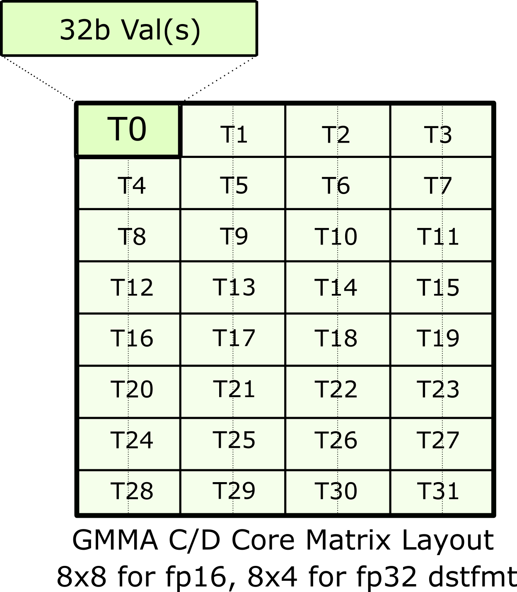
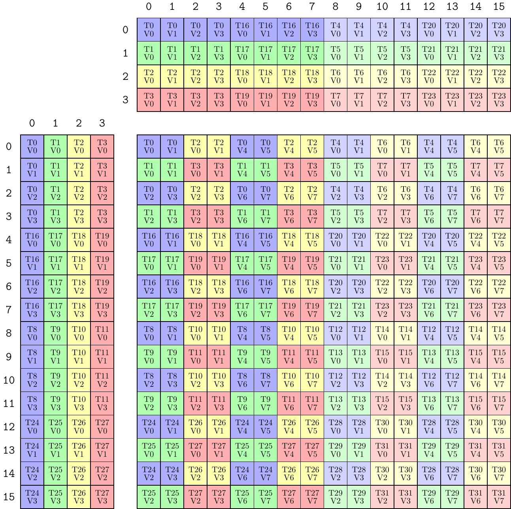
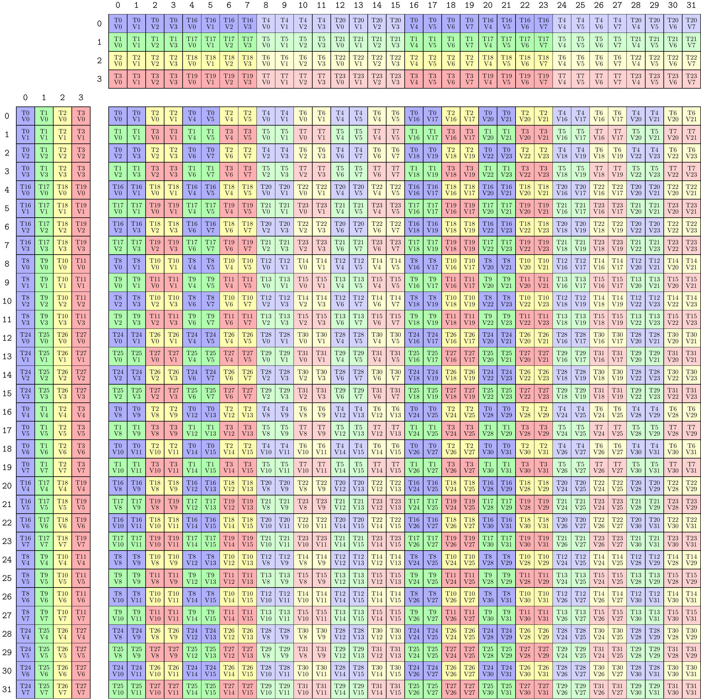

# CuTe 对矩阵乘加指令的支持（CuTe’s Support for Matrix Multiply-Accumulate Instructions）

本文详细解释 CuTe 是如何在库中封装并使用 GPU 的矩阵乘加（MMA, Matrix Multiply-Accumulate）硬件指令的。

MMA 指令是强烈依赖架构（architecture-specific）的。不同代 GPU 会引入不同形态的 MMA 指令。不过，CuTe 借助 `Layout` 等抽象，把这些架构特定能力暴露成了可在通用 CUDA C++ 代码里使用的接口。整体上，CuTe 是分几层来做这件事的：

1. 把每条 MMA 对应的 PTX 指令封装成一个 `Operation` 结构体。
2. 为每个 `Operation` 定义一个对应的 `Traits` 结构体，记录这条指令需要的各种元信息（meta-information）。
3. 把 `Operation` 和 `Traits` 组合成一个 `Atom`，使它既知道底层 PTX 怎么调用，也知道逻辑上的 shape、线程映射和数据映射。
4. 再把一个或多个 `Atom` 继续组合成 `TiledMMA`，以表达更复杂的线程/值分区模式。

## CuTe MMA Atom

在 CuTe 里，每个 MMA 都是以两类结构体的组合形式暴露给通用 CUDA C++ 代码的：

- `Operation` struct
- `MMA_Traits<Operation>` 特化

`Operation` struct 负责封装具体的 PTX 指令。它只描述这条指令真正需要的物理输入与输出，不引入 layout、tensor、非标准数值类型这些更高层抽象，因此软件依赖很少。

对应的 `MMA_Traits` 特化则负责描述“如何使用”这个 `Operation`：包括逻辑数据类型、逻辑 shape，以及线程和元素值在 A/B/C 矩阵中的布局关系。

这两者合起来就是一个 `Atom`。可以把它理解成“单条 MMA 指令的语义封装”。无论底层硬件粒度是一个线程、一个 quadpair、一个 warp，还是一个 warpgroup，Atom 都统一表达“这一次 MMA 逻辑上到底在算什么”。

目前 CuTe 支持的 MMA Atom 覆盖多种硬件粒度，例如：

- 单线程，例如普通 FMA
- Volta 的 quadpair
- Ampere 的 warp 级 MMA
- Hopper 的 warpgroup 级 MMA

### Operation 结构体（Operation Structs）

#### 文件位置（Location of Files）

CuTe 的 `Operation` 结构体位于 [`include/cute/arch`](https://github.com/NVIDIA/cutlass/tree/main/include/cute/arch) 目录下，对应头文件通常以 `mma` 开头。

#### 命名规则（Operation Struct’s Name）

CuTe 中一个 `Operation` 的名字通常直接编码了它所包裹的 PTX 指令信息，常见组成包括：

- 首个支持该指令的架构
- 指令支持的 `M` / `N` / `K`
- 四个操作数 A / B / C / D 的类型
- A、B 的存储排列方式

例如，Volta 章节会用到这个结构体：

`SM70_8x8x4_F32F16F16F32_NT`

它的各部分含义如下：

- `SM70`：Volta 架构
- `8x8x4`：表示 `M=8, N=8, K=4`
- `F32F16F16F32`：表示 `D=float`，`A=half`，`B=half`，`C=float`
- `NT`：表示 A 采用 M-major（不转置 / column-major），B 采用 N-major（转置 / row-major）

### Operation Struct 的内容（Contents）

#### 类型别名（Type Aliases）

每个 `Operation` 都会暴露四个公开类型别名：

- `DRegisters`
- `ARegisters`
- `BRegisters`
- `CRegisters`

例如，`SM70_8x8x4_F32F16F16F32_NT` 定义为：

```c++
using DRegisters = float[8];
using ARegisters = uint32_t[2];
using BRegisters = uint32_t[2];
using CRegisters = float[8];
```

这告诉我们：对这条指令而言，每个线程需要向 PTX 传入多少个寄存器值。

- C 和 D 各需要 8 个 `float`
- A 和 B 各需要 4 个 `half`
- 因为两个 `half` 会打包进一个 `uint32_t`，所以它们表现为 `uint32_t[2]`

#### `fma` 静态成员函数

每个 `Operation` 还会定义一个公开的 `static void fma`。它带有 `CUTE_HOST_DEVICE` 标记，不同指令的 `fma` 参数个数和形式会有所不同。

实现里通常会用宏保护 PTX 调用：如果当前编译环境没有这条 PTX 指令，CuTe 会通过 `assert` 或占位逻辑保证测试和示例仍然能编译通过。

### Traits

#### 文件位置

`MMA_Traits` 位于 [`include/cute/atom`](https://github.com/NVIDIA/cutlass/tree/main/include/cute/atom) 目录下，对应头文件通常以 `mma_traits` 开头。

#### `MMA_Traits` 的内容

一个 `MMA_Traits` 特化通常会定义这些公开类型别名：

- `ValTypeD`：D 矩阵的逻辑计算类型
- `ValTypeA`：A 矩阵的逻辑计算类型
- `ValTypeB`：B 矩阵的逻辑计算类型
- `ValTypeC`：C 矩阵的逻辑计算类型
- `Shape_MNK`：该 MMA 的逻辑 `M x N x K` 形状
- `ThrID`：一次 MMA 内的逻辑线程映射
- `ALayout`：`(thread, value)` 到 A 矩阵 `(m,k)` 坐标的映射
- `BLayout`：`(thread, value)` 到 B 矩阵 `(n,k)` 坐标的映射
- `CLayout`：`(thread, value)` 到 C 矩阵 `(m,n)` 坐标的映射

#### 一个 Traits 示例

以 `SM70_8x8x4_F32F16F16F32_NT` 为例，其 `MMA_Traits` 形如：

```c++
template <>
struct MMA_Traits<SM70_8x8x4_F32F16F16F32_NT>
{
  using ValTypeD = float;
  using ValTypeA = half_t;
  using ValTypeB = half_t;
  using ValTypeC = float;

  using Shape_MNK = Shape<_8,_8,_4>;
  using ThrID   = SM70_QuadPair;
  using ALayout = SM70_8x4_Col;
  using BLayout = SM70_8x4_Col;
  using CLayout = SM70_8x8_32b;
};
```

下面的 Volta 和 Hopper 两节，就是在拆解这些字段到底意味着什么。

## Volta

这一节不试图穷举所有架构和所有 MMA，而是用 Volta 和 Hopper 两个典型例子，演示“如何给某条新指令建立 Atom”。

Volta 提供 HMMA 指令，由 8 个线程组成的 quadpair（QP）协同完成一次 `8x8x4` 的矩阵乘加。如果把一个 warp 看成 32 个线程，那么一个 warp 可以看成包含 4 个 quadpair，合起来能覆盖 `16x16x4` 的 tile。

下面这张图展示了 HMMA NT 指令在线程和数据上的分工（如果要查找mma指令中线程与数据的分配即类似下面的图，可以去PTX文档中找，例如HMMA可以在参考[PTX ISA 6.4](https://docs.nvidia.com/cuda/archive/10.1/pdf/ptx_isa_6.4.pdf)的第9.7.13.5节找到）：


### 类型（Types）

该 HMMA NT 对应的逻辑类型如下：

```cpp
using ValTypeD = float;
using ValTypeA = half_t;
using ValTypeB = half_t;
using ValTypeC = float;
```

后面的 `Shape_MNK`、`ALayout`、`BLayout`、`CLayout` 都是在这些类型语义之上定义的。

### Shape

HMMA NT 的逻辑 shape 是 `8x8x4`：

```cpp
using Shape_MNK = Shape<_8,_8,_4>;
```

### 线程映射（Thread ID）

如果一个 warp 的 32 个线程按逻辑编号 `[0..31]`，那么图中的这个 HMMA 实际用到的是：

`[0,1,2,3] U [16,17,18,19]`

也就是第 0 个 quadpair。

因此，我们可以定义一个 `ThrID`，把 MMA 内部的 8 个逻辑线程 ID `[0..7]` 映射到 warp 中真正参与执行的物理线程索引：

```cpp
// Mapping from (logical thread id) -> (thread idx)
using ThrID = Layout<Shape <_4, _2>,
                     Stride<_1,_16>>;
```

这表示：

- 前 4 个逻辑线程步长为 1，对应 `0,1,2,3`
- 再复制 2 组，组间步长为 16，对应 `16,17,18,19`

### 累加器映射（Accumulator Mapping,文档有点不清晰，后面我会补充解释）

接下来要编码的是 C / D 累加器的线程-数据布局。下图左边展示整个 quadpair 视图，右边展示 thread 0 拥有的值：


`CLayout` 的目标是建立：

`(logical_thr_id, logical_val_id) -> (m, n)`

的映射。

首先，HMMA 一共有 8 个线程，每个线程拥有 8 个累加器值，因此可以先写出一个雏形：

```cpp
// (T8,V8) -> (m,n)
using CLayout = Layout<Shape <_8, _8>,
                       Stride<_?, _?>;  // Stride to be filled in below
```

这里的 `8x8` 不是逻辑上的 `8x8` 矩阵，而是“8 个线程，每线程 8 个值”。

接下来，CuTe 需要的是一个“索引”，而不是直接返回 `(m,n)` 坐标。因此文档选择把 `(m,n)` 编码成列主序的一维索引：

`m + n * M`

然后依次观察不同线程、不同 value id 对应到哪个 `(m,n)`。根据图中的分布，可以把线程维拆成一个多层 shape / stride：

```cpp
using CLayout = Layout<Shape <Shape <_2,  _2, _2>, _8>,
                       Stride<Stride<_1, _16, _4>, _?>;
```

再沿 `logical value id` 方向做同样的分析，就能得到完整的 `CLayout`：

```cpp
// (T8,V8) -> (m,n)
using CLayout = Layout<Shape <Shape <_2, _2,_2>, Shape <_2,_2, _2>>,
                       Stride<Stride<_1,_16,_4>, Stride<_8,_2,_32>>>;
```

这就完成了 F32 累加器的线程-值到 `(m,n)` 的完整编码。

如果累加器类型是 F16，布局会简单很多，因为每一整行 `(m,:)` 都落在一个线程里，这时可以写成：

```cpp
using CLayout = Layout<Shape <_8,_8>,
                       Stride<_1,_8>>;
```

#### 补充解释
计算ABClayout的方式：
首先要理解ABC这三个layout的作用：把(thread_id, value_id)映射到矩阵的(m,n)坐标，layout的第一mode表示同一个值下不同thread的布局，第二个mode表示同一个thread下不同value的布局。

计算方式我总结为跳变加重复。首先明确不管是NT还是TN都是按照列主序的方式计算。对于layout的shape，stride规律发生变化的时候就要加一维，如果最后还要重复还要加一维，加的这一维反映跳变之前的那个维度的规律。对于layout的stride，就是该维第一个元素离第零个元素的距离。
例如对于上面的Clayout，先求threadlayout，即固定V0，则有
```
T0:0 T1:1 
// 这里stride发生了跳变，之前的stride一次加1，但是T1到T2直接加了15，所以要加一维，加的这一维反映跳变之前的规律，即2:1
T2:16 T3:17
// 这里stride又发生了跳变，不过这个跳变不是指T3到T4，而是T2到T4，之前T0到T2的stride为16，但是T2到T4的stride明显不是16，所以要加一维，依旧反映上一维的规律，即2:16
T4:4 T5:5
// 依旧2:4
T6:20 T7:21
// 后续没有跳变，跳变结束
// 观察M维度是否有重复，有T0和T4相当于重复，所以加一维2:4
```

同样的，对于valuelayout，固定T0，然后看values之间的布局。

### A / B 布局映射（A and B Layout Mapping）

A、B 的布局映射取决于输入是否转置。下图展示了 HMMA 在 NT 和 TN 两种情况下，线程如何拥有 A / B 数据：


先看 TN 情况下的 A。仍然是 8 个逻辑线程，但每个线程只拥有 4 个值，因此：

```cpp
// (T8,V4) -> (m,k)
using ALayout = Layout<Shape <_8,_4>,
                       Stride<_1,_8>>;
```

推导方式和前面类似：沿 `M` 方向看，线程切换产生 stride 1；沿 `K` 方向看，value 切换产生 stride 8。

对于 TN 情况下的 B，如果按 CuTe 约定使用 `(N,K)` 而不是 `(K,N)` 来表达，它的布局恰好与 A 一样：

```cpp
// (T8,V4) -> (n,k)
using BLayout = Layout<Shape <_8,_4>,
                       Stride<_1,_8>>;
```

而在 NT 情况下，A/B 的布局会更复杂一些，因为 `M` / `N` 方向上的值分配本身带有分层结构。对 A 来说：

```cpp
// (T8,V4) -> (m,k)
using ALayout = Layout<Shape <Shape <_4,_2>,_4>,
                       Stride<Stride<_8,_4>,_1>>;
```

对应的 B（按 `(N,K)` 约定）也是同样结构：

```cpp
// (T8,V4) -> (n,k)
using BLayout = Layout<Shape <Shape <_4,_2>,_4>,
                       Stride<Stride<_8,_4>,_1>>;
```

NN 与 TT 本质上只是前面两类布局的不同组合。

### 注意
TN与NT只是数据在内存中的布局，而这里ABC的layout是(thread_id, value_id)到矩阵的(m,n)坐标，而这种映射在cute中规定都是列主序的，与TN或NT无关。

## Hopper

接下来看看 Hopper 首次引入的 GMMA（Group MMA）。GMMA 以 128 线程为粒度，也就是 4 个 warp 共同组成一个 warpgroup 来执行一次 MMA。

### 线程映射（Thread ID）

在 Hopper GMMA 中，thread ID 的分布很简单，是连续的一维布局：

```cpp
using ThrID = Layout<_128, _1>;
```

### 累加器映射（Accumulator Mapping）

GMMA 的累加器布局是分层构造的。文档先引入一个“核心矩阵（core matrix）”概念，再用它拼出完整的 C tile。下面这张图展示了 fp16 累加器对应的核心矩阵：


然后，GMMA 会先沿 M 方向把这个 core matrix 竖直堆叠，再沿 N 方向把这些“core-matrix 列”重复展开，构成完整的 `M x N` tile（不用太关心core matrix以及堆叠方式，PTX文档中会给出完整的排列方式，如[PTX ISA 9.2](https://docs.nvidia.com/cuda/parallel-thread-execution/index.html#asynchronous-warpgroup-level-matrix-register-fragment)）：


以 `SM90_64x128x16_F16F16F16F16_TN` 为例，目标仍然是构造：

`(logical_thr_id, logical_val_id) -> (m, n)`

的映射。

从图中可以看出：

- 首先是 4 个线程一组
- 每组线程持有成对的值，沿 N 方向展开

因此可以先写出：

```cpp
// (T128,V4) -> (M64,N8)
using CLayout = Layout<Shape <Shape <  _4, ...>, Shape < _2, ...>>,
                       Stride<Stride<_128, ...>, Stride<_64, ...>>>;
```

然后：

- 这 4 个线程会沿 M 方向重复 8 次，补齐一个 `8x8` core matrix
- 接着通过 value 维的扩展跳到 `(T0, V2)`
- 最后每个 warp 再沿 M 方向叠成一列，4 个 warp 共同形成完整的 `64x8`

于是完整的 `64x8` 累加器布局可以写成：

```cpp
// (T128,V4) -> (M64,N8)
using CLayout = Layout<Shape <Shape <  _4, _8,  _4>, Shape < _2, _2>>,
                       Stride<Stride<_128, _1, _16>, Stride<_64, _8>>>;
```

如果 N 从 8 扩大到 128，只需要再沿 N 方向复制这块 `64x8` 的模式即可。例如 `64x128` 时：

```cpp
// (T128,V64) -> (M64,N128)
using CLayout = Layout<Shape <Shape <  _4, _8,  _4>, Shape < _2, _2,  _16>>,
                       Stride<Stride<_128, _1, _16>, Stride<_64, _8, _512>>>;
```

#### 补充解释
其实这里没有那么复杂，还是用我刚刚的跳变加重复解释，
对于threadlayout，固定V0，则有：
```
T0:0 T1:128 T2:258 T3:384 
// 跳变，积累4:128
T4:1 ...
T8:2 ...
T16:3 ...
T20:4 ...
T24:5 ...
T28:6 ...
// 跳变，积累8:1
T32:16 ...
// 后续就是一直重复，重复积累4:16
所以threadlayout为(4,8,4):(128,1,16)
```

对于Valuelayout，固定T0，则有：
```
V0:0 V1:64
// 跳变，积累2:64
V2:8 V3:8+64
// 跳变:积累2:8
V4:8*64 V5:8*64+1
// 后续无跳变，但是128/8=16，重复16次，每次重复的stride为8*64=512，所以积累16:512
所以valuelayout为(2,2,16):(64,8,512)
```


### A / B 布局映射

Hopper 的 GMMA 如果直接从共享内存读取 A / B，会稍微有点反直觉：GMMA descriptor 并不是基于“某些线程各自拥有的 A/B 子块”构造的，而是直接基于共享内存里的整块 A 或 B tile 构造的。

换句话说，对线程而言，这整块 tile 是“共同可见”的，并不会先按线程做重排。

因此，`ALayout` 可以写成：

```cpp
// (T128,V64x16) -> (M64,K16)
using ALayout = Layout<Shape <_128, Shape <_64,_16>>,
                       Stride<  _0, Stride< _1,_64>>>;
```

这表示：

- 所有线程在“线程维”上都映射到同一个 `(m,k)=(0,0)` 起点，因此线程 stride 为 0
- 真正的数据 shape 保持为 `(M,K)`，不做线程级重排

这样，GMMA descriptor 构造器就能直接检查这块 `(M,K)` 布局是否满足 GMMA 的要求，不满足时也能给出错误提示。

## `TiledMMA`

通过组合和交错多个 Atom，我们可以构造更复杂的 MMA 模式，也就是 `TiledMMA`。

先从最简单的单 Atom 开始：

```cpp
MMA_Atom mma = MMA_Atom<SM70_8x8x4_F32F16F16F32_NT>{};
print_latex(mma);
```

对应图如下：


它等价于：

```cpp
TiledMMA mma = make_tiled_mma(SM70_8x8x4_F32F16F16F32_NT{},
                              Layout<Shape<_1,_1,_1>>{},   // Layout of Atoms
                              Tile<_8,_8,_4>{});           // Tiler
```

因为它只包含一个 Atom，并且采用了自然 tile 大小 `8x8x4`。

接着，我们可以把 4 个 quadpair MMA 组合起来，构造一个类似 WMMA 的对象：

```cpp
TiledMMA mma = make_tiled_mma(SM70_8x8x4_F32F16F16F32_NT{},
                              Layout<Shape <_2,_2>,
                                     Stride<_2,_1>>{});   // 2x2 n-major layout of Atoms
```

效果如下：

· 

这会在线程维上复制 `MMA_Atom`，补上原本没用到的 `T4`、`T8`、`T12` 等线程，使整个 `C` 矩阵变成一个 `16x16x4` 的 MMA。

继续扩大 tile，可以直接把它拓展为 `32x32x4`：

```cpp
TiledMMA mma = make_tiled_mma(SM70_8x8x4_F32F16F16F32_NT{},
                              Layout<Shape <_2,_2>,
                                     Stride<_2,_1>>{},  // 2x2 n-major layout of Atoms
                              Tile<_32,_32,_4>{});      // 32x32x4 tiler
```

图示如下：



这一次扩展发生在 value 维，而不是线程维，因此同样的线程会拿到更多值。

还可以进一步对某个 mode 做排列（permutation）。例如，文档展示了如何重新排列 M 方向，使每个线程从 A 矩阵读取的坐标更连续：

```cpp
TiledMMA mma = make_tiled_mma(SM70_8x8x4_F32F16F16F32_NT{},
                              Layout<Shape <_2,_2>,
                                     Stride<_2,_1>>{},       // 2x2 n-major layout of Atoms
                              Tile<Layout<Shape <_4,_4,_2>,
                                          Stride<_1,_8,_4>>, // Permutation on M, size 32
                                   _32,                      // Permutation on N, size 32 identity
                                   _4>{});                   // Permutation on K, size 4 identity
```

对应图如下：


文档把这个 M 方向置换解释为一种 scatter permutation。其作用是：

- 只重排 M mode
- 让 A 和 C 在逻辑 M 坐标上更连续
- 方便为共享内存或寄存器设计更友好的布局

当然，对 N mode 和 K mode 做类似排列也是允许的。

这些 `TiledMMA` 最终会怎么作用到真实数据 tensor 上，可以继续看 GEMM 教程 [`0x_gemm_tutorial.zh-CN.md`](./0x_gemm_tutorial.zh-CN.md)。

# 测试

这一节对应的测试名是 `mma_atom`。

运行方式：

```bash
python tests/run.py mma_atom
```

脚本每次会随机抽取 3 个真实的 `MMA operation` 题目，例如：

```cpp
SM75_16x8x8_F32F16F16F32_TN
```

要求你输出它对应的 `CLayout`。

换句话说，题目的标准答案就是：

```cpp
MMA_Traits<Operation>::CLayout
```

这些 operation 都来自 CUTLASS 里的真实 `MMA_Traits` 特化，不是伪造的题目名；测试脚本也会校验对应 operation 名字确实存在于头文件中。

答案需要按 `shape:stride` 的完整格式输入，空格不敏感。例如：

```text
((4, 8), (2, 2)):((32, 1), (16, 8))
((4, 8, 4), (2, 2, 1)):((128, 1, 16), (64, 8, 512))
```

如果你想复现同一套题，可以指定随机种子：

```bash
python tests/run.py mma_atom --seed 20260415
```

查看标准答案或做非交互判分：

```bash
python tests/run.py mma_atom --show-answers
python tests/run.py mma_atom --seed 20260415 --show-answers
python tests/run.py mma_atom --seed 20260415 --answers "((4,8),2):((16,1),8)" "((2,2,2),(2,2,2)):((1,16,4),(8,2,32))" "((4,8),(2,2)):((32,1),(16,8))"
```
